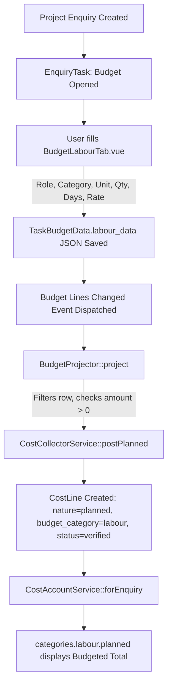
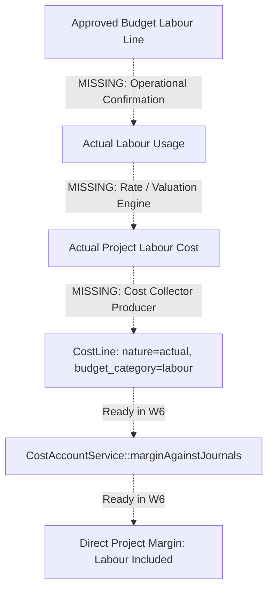

# 37 — PHASE 2B WORKFLOW 7 LABOUR COST

# DECISION CONFIRMATION & ARCHITECTURE RECONCILIATION REPORT

**Date:** 2026-09-24  
**Author:** Independent Architecture & Governance Review  
**Branch (Backend):** `finance/critical-stabilization-fixes`  
**Branch (Frontend):** `master`  
**Status:** **W7 READY FOR WNG DECISIONS**  
**Governance Anchor:** `03_WNG_FINANCE_DECISION_REGISTER.md`  

---

## 1. EXECUTIVE SUMMARY

Workflow 7 (Labour Cost) establishes how project labour is attributed, valued, and integrated into Project Costing and Company Financial Accounts.

Following the independent closure of Workflow 6 (Project Costing, Report 36), this report reconciles the business requirements, repository reality, and authoritative accounting principles for Workflow 7.

Crucially, **WNG has confirmed three foundational business facts that override earlier assumptions**:
1. **Labour is already planned during Project Budget creation.** At WNG, project labour is established during the preparation of the Project Budget. WNG does not require or desire a standalone timesheet-entry workflow invented from scratch.
2. **The existing HR "Technical/Casual Labour" functionality is discarded / not in operational use.** It must be decommissioned rather than resurrected or made the foundation of W7.
3. **The existing Employee Records architecture is the authoritative employee master.** Worker identity, roles, and departments must be sourced from Employee Records without creating duplicate master directories.

Therefore, the core technical problem for Workflow 7 is reframed:
> **How should WNG convert/reconcile the labour already planned in the Project Budget into controlled actual project labour costing without duplicating payroll expense?**

This report provides the full architectural, financial, and decommissioning analysis necessary for WNG to make informed decisions. **No migrations, controllers, services, or production implementations have been created in this task.**

---

## 2. WNG BUSINESS CLARIFICATION

The earlier preliminary briefs (`24_W7_LABOUR_COST_DECISION_BRIEF.md` and `25_W7_LABOUR_COST_GAP_ANALYSIS.md`) assumed that WNG might need either an individual timesheet system or an extension of the existing `TechnicalLabour` / `JobCard` model.

WNG's explicit clarification establishes that:
* **The Project Budget is the starting point.** In WNG's event, exhibition, and fabrication operations, estimating and budgeting labour is an established, working operational process. Requiring staff to re-enter planned labour into a second system is rejected under the ERP-first principle of *"Capture once → reuse downstream."*
* **The HR Technical/Casual Labour register is obsolete.** It was built as a parallel worker directory but is not in operational use by HR, Production, or Finance.
* **Employee Records are the sole master.** If individuals need to be tracked or referenced, they must come from `employees`.
* **Budgeted Labour ≠ Actual Labour.** An approved budget line is a plan; it does not constitute economic proof of incurred project cost. Actual labour requires operational confirmation.

---

## 3. CURRENT PROJECT BUDGET LABOUR ARCHITECTURE

A comprehensive code trace across `TaskBudgetData.php`, `BudgetService.php`, `BudgetProjector.php`, and `BudgetLabourTab.vue` reveals the exact current-state budget implementation:

### 3.1 Data Storage & Model
* **Model:** `App\Models\TaskBudgetData` (`task_budget_data` table).
* **Column:** `labour_data` (JSON cast to array).
* **Parent Link:** Belongs to `EnquiryTask` (`enquiry_task_id`), which links to `ProjectEnquiry` (`project_enquiry_id`), which in turn carries `job_number`, `project_id`, and `title`.

### 3.2 Labour Line Structure
Each row in the `labour_data` array contains:
* `id`: Unique client-generated ID (string/uuid, e.g. `labour-1711234567890`).
* `type`: Role / Team description. Selected from predefined `COMMON_TEAM_TYPES` or entered as text:
  * *Pasting Team, Technicians, Painters, Welders, Electricians, ICT, Loading, Offloading, Carpenters.*
* `category`: Operational stage / classification:
  * *Production, Set Up (Installation), Set down (Installation), Technical, Supervision, Other.*
* `unit`: Measurement unit:
  * *PAX, days, hours, shift.*
* `quantity`: Numeric count (e.g. number of workers/PAX).
* `days`: Numeric duration in days (default: 1, step: 0.5).
* `unitRate`: Unit rate in KES per unit per day/period.
* `amount`: Calculated total:  
  $$\text{amount} = \text{quantity} \times \text{days} \times \text{unitRate}$$
* `isIncluded` / `is_included`: Boolean inclusion toggle.

### 3.3 Preparation, Autosave & Approval
* **Preparation:** Created by the Project Officer or Costing Estimator on the `BudgetLabourTab.vue` inside `BudgetTask.vue`.
* **Autosave:** The budget screen debounces and saves every 2 seconds (`PUT /api/projects/tasks/{taskId}/budget`).
* **Approval State:** Internal budget approval was deliberately retired on 2026-07-07 (`BudgetService::resolveSaveStatus()`). Budgets remain in `status = 'draft'` until the budget task itself is formally marked completed (`PUT /api/projects/tasks/{id}/status` -> `'completed'`).

### 3.4 Append-Only Budget Revisions & Projection
* **Budget Revision Recorder:** `App\Services\Governance\BudgetRevisionRecorder` detects when an enquiry's budget changes after verified expenditure has been committed against it. Successive edits within 10 minutes by the same actor coalesce into one `budget_revised` governance audit log entry.
* **Projection to Cost Lines:** `BudgetProjector::project()` reads `labour_data` and projects each active labour row into `cost_lines` via `CostCollectorService::postPlanned()`:
  * `nature = 'planned'`
  * `status = 'verified'`
  * `details->budget_category = 'labour'`
  * `source_type = 'BudgetLine'` (or `TaskBudgetData::class`)
  * `source_id = $budget->id`
  * `source_ref = (string) $row['id']`
* **Append-Only Replacement:** When a budget line is revised, `CostCollectorService::postPlanned()` marks the prior planned line as `status = 'reversed'` (`query_note = 'Superseded by a revised project budget line.'`) and creates a new planned line. It never deletes or silently edits posted history.

---

## 4. CURRENT EMPLOYEE RECORDS ARCHITECTURE

The authoritative master for personnel is `App\Modules\HR\Models\Employee` (`employees` table):
* **Identifiers:** `id`, `employee_id` (e.g. EMP-0012), `first_name`, `last_name`, `id_number`, `kra_pin`, `nssf_id`, `nhif_id`.
* **Organizational Structure:** `department_id` (belongsTo `Department`), `position`, `manager_id` (belongsTo `Employee`).
* **Employment & Compensation:** `status` (active, inactive, on_leave, terminated), `employment_type` (permanent, contract, probation, casual), `hire_date`, `salary` (basic monthly wage/salary), `bank_name`, `account_number`, `statutory_exemptions`.
* **Security & Scoping:** Scoped by `AccessibleByUser` (Super Admin, HR, Project Officers, Department Managers).
* **Subledgers:** Carries relations to `payslips()`, `leaveRequests()`, `otEntries()`, and `ledgerEntries()`.

`Employee` is already the universal master for HR and Payroll. W7 must map project labour directly to `employees` without creating a parallel employee table.

---

## 5. CURRENT PAYROLL ARCHITECTURE

Payroll is fully implemented and operating under forward-only financial controls:
* **Calculation Engine:** `CalculationPipeline` runs `BasicPayProcessor`, `LedgerProcessor`, `StatutoryProcessor` (PAYE, NSSF Tier I/II, SHIF, Affordable Housing Levy), and `NetPayProcessor`, generating individual `Payslip` records under a `PayrollRun`.
* **Company Accounting Accrual:** `PayrollFinancePostingService::postAccrual()` posts a balanced journal entry (`JE-PR-A-xxxxxxx`) at the end of each payroll month:
  * **Direct Labour Expense (`5200`):** Gross pay and employer statutory costs for employees whose department has `labour_classification = 'direct'`.
  * **Salaries & Wages Expense (`7550`):** Gross pay and employer statutory costs for employees whose department has `labour_classification = 'indirect'` (office, admin, overhead).
  * **Liabilities:** Net Payroll Payable (`2160`), PAYE Payable (`2130`), Statutory Contributions Payable (`2140`).
* **Cash Disbursement:** `PayrollFinancePostingService::postPayment()` executes net pay settlement through `PaymentSettlementService::settle()` using an independent `Payment` record and journal `JE-PR-P-xxxxxxx` (debit Net Payroll Payable `2160`, credit Bank/Cash `PaymentSource`).

Payroll owns company-level expense recognition and cash movement. It does not attribute cost to individual project job numbers.

---

## 6. OBSOLETE TECHNICAL/CASUAL LABOUR ARCHITECTURE

A comprehensive audit of the `TechnicalLabour` implementation revealed:
* **Database Table:** `technical_labours` (fields: `id`, `full_name`, `phone`, `email`, `id_number`, `specialization`, `day_rate`, `status`, `rating`, `notes`, `employee_id`, `promoted_at`).
* **Backend Model:** `App\Modules\HR\Models\TechnicalLabour`.
* **Backend Controller:** `App\Modules\HR\Http\Controllers\TechnicalLabourController` (API resource, promote, import template).
* **Routes:** `/api/hr/technical-labour`, `/api/hr/technical-labour/{id}/promote`, `/api/hr/technical-labour/import`.
* **Production Dependencies:**
  * `App\Modules\Production\Models\JobCard`: Has `worker_id` pointing to `TechnicalLabour` with a fallback accessor checking `Employee`.
  * `App\Modules\Production\Http\Controllers\JobCardController`: Dropdown queries `TechnicalLabour::active()`.
  * `App\Modules\Production\Http\Controllers\WorkOrderTaskController`: Validates assignee type in `employee,technical_labour`.
  * `App\Modules\Production\Http\Controllers\ProductionAssigneeController`: Unions employees and technical labour.
* **Teams Dependencies:**
  * `App\Modules\Teams\Models\TeamsMember`: Carries `technical_labour_id`.
* **Overtime Dependencies:**
  * `App\Modules\HR\Models\OTEntry`, `LedgerEntry`, `Compensation`: Carry nullable `technical_labour_id`.
* **Frontend Components:**
  * `TechnicalLabourPanel.vue` (rendered inside `EmployeeManagement.vue` under the "Technical" tab).
  * `useTechnicalLabour.ts` (API composable).
  * References in `TeamsTask.vue`, `JobCardForm.vue`, `WorkOrderDetailsView.vue`, `ReportTask.vue`.

---

## 7. TECHNICAL/CASUAL LABOUR DEPENDENCY MAP

| Component / Artifact | Path / Location | Current Role / Usage | Status |
|---|---|---|---|
| `technical_labours` Table | Migration `2026_01_25_091243` | Standalone table for casual day-rate workers | **HISTORICAL DATA ONLY / UNUSED** (0 rows in local DB) |
| `TechnicalLabour.php` | `app/Modules/HR/Models/` | Eloquent model | **UNUSED AS ACTIVE HR WORKFLOW** |
| `TechnicalLabourController.php` | `app/Modules/HR/Http/Controllers/` | CRUD endpoints for technical labour | **UNUSED** |
| `TechnicalLabourPanel.vue` | `src/modules/hr/components/` | Vue admin panel in HR module | **UNUSED** |
| `useTechnicalLabour.ts` | `src/modules/hr/composables/` | Frontend API client | **UNUSED** |
| `JobCard.php` | `app/Modules/Production/Models/` | Worker resolution checks `TechnicalLabour` first, falls back to `Employee` | **ACTIVE DEPENDENCY (FALLBACK EXISTS)** |
| `WorkOrderTaskController.php` | `app/Modules/Production/Http/Controllers/` | Assignee validation allows `technical_labour` | **ACTIVE DEPENDENCY** |
| `TeamsMember.php` | `app/Modules/Teams/Models/` | `technical_labour_id` column | **HISTORICAL SCHEMA DEPENDENCY** |
| `OTEntry.php` / `LedgerEntry.php` | `app/Modules/HR/Models/` | Nullable `technical_labour_id` column | **HISTORICAL SCHEMA DEPENDENCY** |
| `PayrollFinancePostingService.php` | `app/Modules/HR/Services/Payroll/` | Zero references to technical labour | **NO DEPENDENCY (CLEAN)** |
| `CostCollectorService.php` / `CostLine.php` | `app/Modules/Finance/CostCollector/` | Zero references to technical labour | **NO DEPENDENCY (CLEAN)** |

---

## 8. DECOMMISSIONING ASSESSMENT

Technical/Casual Labour can be decommissioned safely without destabilizing the system:

### 8.1 Can Remove Now (Frontend & API Entry Points)
* Remove the "Technical" tab from `EmployeeManagement.vue` and deprecate `TechnicalLabourPanel.vue`.
* Remove `/api/hr/technical-labour` routes from `app/Modules/HR/Routes/api.php`.
* Stop displaying `TechnicalLabour` in assignee dropdowns (`JobCardController`, `ProductionAssigneeController`).

### 8.2 Must Preserve for Historical Records / Schema Stability
* The `technical_labours` table and foreign key columns (`teams_members.technical_labour_id`, `ot_entries.technical_labour_id`, `job_cards.worker_id`) must remain in the schema so existing database migrations, rollback chains, and historical logs are not broken.
* If production databases contain legacy records in `technical_labours`, they should be retained in read-only mode for audit compliance.

### 8.3 Must Migrate / Harmonize First
* In `JobCard.php` and `JobCardController.php`, update `worker()` to point directly to `Employee`. Workers performing production tasks should exist as `Employee` records (under employment_type = `'casual'` or `'contract'`).

---

## 9. CURRENT BUDGETED LABOUR FLOW

The verified end-to-end flow of budgeted labour today is:



**Observation:** The budget pipeline for labour is robust, automated, and append-only. Planned labour is already mirrored into `cost_lines` as a first-class planned commitment.

---

## 10. MISSING ACTUAL LABOUR FLOW

While Budgeted Labour reaches `cost_lines` as `nature = 'planned'`, there is currently **no mechanism** that records or converts actual labour into `cost_lines` with `nature = 'actual'`.



Because of this missing flow:
* `categories['labour']['actual']` is permanently KES 0.00.
* `categories['labour']['variance']` is artificially equal to the entire planned budget.
* W6 deliberately badges Labour as `Not Included`.

---

## 11. BUDGET VS ACTUAL LABOUR GAP

| Dimension | Project Budget Labour (Current) | Actual Project Labour (Target) |
|---|---|---|
| **Nature** | `planned` | `actual` |
| **Origin** | Project Estimation / Costing Team | Production Lead / Site Captain / Project Officer |
| **Timing** | Prior to or at project start | During or at completion of operational work |
| **Unit** | PAX × Days × Rate (or Hours × Rate) | Actual days/hours delivered |
| **Linkage** | Enquiry Task / `task_budget_data` | Reference to approved Budget Line + Employee/Crew |
| **Financial Impact** | Sets the cost allowance / baseline | Consumes budget, hits Project Margin |
| **GL Impact** | None (analytical planned line only) | Analytical CostLine (no duplicate GL payroll debit) |

---

## 12. ACTUAL LABOUR CONFIRMATION OPTIONS

WNG must decide how actual labour should be confirmed against the Project Budget:

### Option 1 — Budget-Line Usage Confirmation (Recommended Operational Fit)
* **Mechanism:** The Project Officer or Production/Site Lead opens an actuals confirmation interface linked to the approved budget labour lines.
* **Action:** Confirms: *"Pasting Team planned for 4 days @ 2,500 was actually used for 3.5 days; 2 Carpenters planned for 2 days were used for 2 days."*
* **Merit:** Directly compares against the approved plan. Zero duplicate entry of roles or rates. Extremely fast to execute. Fits project milestone / event set-down rhythm.
* **Drawback:** Does not track individual clock-in/out timestamps.

### Option 2 — Crew/Team Attendance Deployment
* **Mechanism:** Site Captain or Workshop Supervisor confirms a named Crew/Team deployed to Job X on Date Y for Z hours/days.
* **Action:** Matches against the budget category (e.g. "Carpentry Crew deployed to Job #1024").
* **Merit:** Provides operational evidence of team dispatch.
* **Drawback:** Requires establishing structured Crew/Team deployment records in the ERP.

### Option 3 — Individual Employee Timesheet / Task Sign-off
* **Mechanism:** Individual employees log hours/days against specific project job numbers.
* **Merit:** Maximum granular precision.
* **Drawback:** Very heavy administrative burden; poor fit for fast-paced event setup and fabrication environments; high risk of late or neglected data entry.

### Option 4 — Periodic Project Officer Allocation
* **Mechanism:** Monthly or at project financial closure, the Project Officer confirms the final lump-sum labour consumption per budget line.
* **Merit:** Minimal data entry during active project delivery.
* **Drawback:** Prone to retrospective rubber-stamping; low auditability.

---

## 13. LABOUR COST BASIS OPTIONS

When actual labour usage is confirmed, what monetary rate determines the actual cost?

### Basis A — Approved Project Budget Standard Rate (Recommended for Management Costing)
* **Formula:** $\text{Actual Cost} = \text{Actual Quantity/Days} \times \text{Approved Budget Unit Rate}$
* **Financial Meaning:** Standard project costing.
* **Advantages:** Clean, immediate, predictable. Never leaks employee salaries. Evaluates project performance against the agreed pricing baseline.
* **Accounting Requirement:** Reconciles against company payroll as a standard-to-actual variance.

### Basis B — Actual Payroll Employment Cost (Hourly/Daily Effective Cost)
* **Formula:** Derived from employee's actual gross pay + statutory costs divided by working days/hours.
* **Financial Meaning:** Absorption costing.
* **Advantages:** Exactly absorbs payroll expense into projects.
* **Disadvantages:** Cannot be calculated until month-end payroll closes; variable from month to month; complex privacy masking required.

### Basis C — Finance-Approved Standard Rate Card
* **Formula:** Company-wide standard rate per skill/role (e.g. Senior Carpenter = KES 3,500/day, Welder = KES 3,000/day).
* **Financial Meaning:** Standard cost based on market/management rates rather than individual project budget rates.

---

## 14. EMPLOYEE/TEAM ATTRIBUTION OPTIONS

When confirming actual labour, what level of worker identity is required?

* **Level 1 — Role / Budget Line Only:** Confirms quantity and days against the budget role (e.g. "5 Welders for 2 days"). Individual names are not recorded on the cost line.
* **Level 2 — Employee Roster Selection:** Selects specific employees from `Employee` records (e.g. "John Doe and Peter Smith worked 2 days as Welders").
* **Level 3 — Team / Crew Entity:** Selects a predefined team (e.g. "Production Team Alpha").

---

## 15. PAYROLL PRIVACY

A strict governance invariant: **Project Officers and site personnel must never see individual salaries, deductions, or confidential payroll data.**

W7 guarantees privacy by design:
1. `CostLine` records store only aggregated cost:
   * `amount`, `net_amount`, `description = 'Carpentry Team — 2 PAX for 3 days'`, `budget_category = 'labour'`.
2. No employee salary, payslip ID, or bank detail is copied onto `cost_lines`.
3. If Employee Records are linked, only public profile fields (`name`, `position`, `department`) are exposed to project managers.

---

## 16. ONE-ECONOMIC-COST-ONCE CONTROL

A critical accounting principle: **Project labour allocation must NEVER create a second company payroll expense.**

* **The Rule:** Payroll accrual (`postAccrual()`) already debits Direct Labour Expense (`5200`) and Salaries (`7550`).
* **The Mechanism:** When W7 produces an `ACTUAL` labour `CostLine`, it must be handed to `CostCollectorService::postFromSource()` with:
  ```php
  $context = new CostContext(
      expenseCode: 'DL-CAS-001', // or appropriate direct labour code
      amount: $actualLabourAmount,
      nature: CostLine::NATURE_ACTUAL,
      enquiryId: $enquiryId,
      consumesLineId: $plannedLineId, // links to and consumes the budget line!
      sourceType: 'LabourConfirmation',
      sourceId: $confirmationId,
      postsIndependently: false, // STAB-7 INVARIANT: DO NOT POST TO GL AGAIN!
  );
  ```
* Because `postsIndependently: false`, `CostCollectorService` inserts the `CostLine` for analytical Project Costing and budget variance, but **bypasses `JournalPostingService::postCostLine()`**.
* Total company P&L expense remains exactly equal to the payroll run.

---

## 17. PROJECT COSTING INTEGRATION

Once W7 produces verified `ACTUAL` labour lines:
1. `CostAccountService::forEnquiry()` will automatically:
   * Group actual labour lines into `$categories['labour']['actual']`.
   * Display Budgeted vs Actual vs Variance for labour.
2. Direct Project Margin (`marginAgainstJournals()`):
   * Includes actual labour in `cost_of_sales`.
   * Transitions `cost_completeness['labour']` from `'not_included'` to `'included'`.
   * When all required categories are included, margin status matures from `provisional` toward `final` (upon project closure).

---

## 18. BUDGET REVISION INTERACTION

If the Project Budget labour is revised after work starts:
* `BudgetRevisionRecorder` continues to track the revision if expenditure is already committed.
* `BudgetProjector` marks obsolete planned lines as `reversed` and inserts new planned lines.
* Any actual labour that already consumed a prior planned line preserves its original `consumes_line_id` reference for complete audit lineage.

---

## 19. CLOSED PROJECT INTERACTION

W6 established strict financial closure guards (`CostCollectorService::collect()` lines 40–60):
* A financially closed project **rejects** all new cost lines.
* If late labour is discovered after project financial closure, it cannot bypass the closure guard.
* The late-cost exception workflow must be used: a user with `finance.costs.reopen` must formally reopen the project with a stated business reason.

---

## 20. UNPLANNED LABOUR

If actual labour was deployed that was not in the original Project Budget:
* The actual confirmation interface must require an explicit flag: `is_unplanned = true`.
* Requires an operational justification reason.
* Handed to Cost Collector with `consumes_line_id = null`.
* The Cost Account will explicitly flag it under `unbudgeted` spend, highlighting an overrun rather than hiding it.

---

## 21. LABOUR OVER BUDGET

When actual labour exceeds the budgeted amount:
* The system must **not** silently inflate the budget.
* The system must record the actual cost in full so true project profitability is transparent.
* If actual labour exceeds the budget by more than the configured threshold (`cost_overrun_alert_percent`), `CostAccountService::alerts()` triggers an active `cost_overrun` alert.

---

## 22. CORRECTIONS & RECLASSIFICATION

If actual labour was attributed to the wrong project:
* Silent database edits are prohibited.
* Reuses W6-4 Cost Transfer architecture (`CostTransferService::transfer()`):
  * Issues a reversing negative CostLine on Project A (`CL-TRF-OUT-xxxxx`).
  * Issues a positive CostLine on Project B (`CL-TRF-IN-xxxxx`).
  * Records the reason, actor, and timestamp in `cost_line_transfers`.

---

## 23. ROLES & SEGREGATION OF DUTIES

| Action | Proposed Role | Notes |
|---|---|---|
| Prepare Labour Budget | Project Officer / Estimator | Current working process in `BudgetTask.vue` |
| Record / Confirm Actual Labour | Production Lead / Site Captain / Project Officer | Operational verification of work done |
| Verify Labour Monetary Cost | Accounts / Finance | Maker-checker validation |
| Authorize Late Labour on Closed Project | Management / Finance Lead | Requires `finance.costs.reopen` |
| Reclassify / Transfer Labour Cost | Accounts | Requires `finance.costs.transfer` |

---

## 24. W7 DECISION TABLE FOR WNG REVIEW

| ID | Decision Required | Current State | Options | Decision Owner | Recommended Direction (Technical) | Status |
|---|---|---|---|---|---|---|
| **W7-1** | **Actual Labour Confirmation Method** | Labour is planned in Project Budget (`labour_data`), but no actual confirmation exists | **A:** Confirm actuals against approved budget lines (PAX/Days used)<br>**B:** Crew/Team deployment confirmation<br>**C:** Individual timesheets<br>**D:** Periodic Project Officer confirmation | Management + Operations | **Option A (Budget-Line Usage Confirmation):** Reuses the approved budget without duplicate entry; lowest operational friction. | **AWAITING WNG CONFIRMATION** |
| **W7-2** | **Actual Labour Cost Basis** | Rates exist in Project Budget and `Employee.salary`, but no actual project cost rate is confirmed | **A:** Approved Budget standard rate × actual usage<br>**B:** Actual payroll employment cost (month-end absorption)<br>**C:** Finance standard rate card | Finance / Accounts Lead + Management | **Option A (Approved Budget Rate):** Stable, immediate project costing; isolates project margin from monthly payroll variance. | **AWAITING FINANCE / WNG CONFIRMATION** |
| **W7-3** | **Worker Attribution Detail** | No worker identity on budget lines | **A:** Role/Category level only (no individual names)<br>**B:** Specific Employee Record selection<br>**C:** Named Crew/Team entity | HR + Operations | **Option A with optional Option B:** Role-level by default, with optional employee tagging where accountability is needed. | **AWAITING WNG CONFIRMATION** |
| **W7-4** | **Actual Confirmation Owner** | No confirmation workflow exists | **A:** Site Captain / Production Lead<br>**B:** Project Officer<br>**C:** Joint (Site Lead records, PO approves) | Operations + Management | **Option A or B** depending on whether work is workshop fabrication or site event. | **AWAITING WNG CONFIRMATION** |
| **W7-5** | **Financial Verification** | No verification step for labour | **A:** Required (Finance verifies before `CostLine` becomes actual)<br>**B:** Auto-verified upon operational approval | Finance / Accounts Lead | **Option A:** Preserves maker-checker segregation of duties. | **AWAITING FINANCE CONFIRMATION** |
| **W7-6** | **Unplanned Labour Handling** | Unplanned labour not supported | **A:** Require justification + record as unbudgeted<br>**B:** Block completely unless budget is revised first | Management | **Option A:** Never blind the ERP to real costs incurred; record as unbudgeted. | **AWAITING WNG CONFIRMATION** |
| **W7-7** | **Labour Over-Budget Action** | Alerts exist in `CostAccountService` | **A:** Warning alert only (record actuals)<br>**B:** Escalate to Management when threshold exceeded<br>**C:** Hard stop | Management | **Option B:** Record real cost, trigger management escalation flag. | **AWAITING WNG CONFIRMATION** |
| **W7-8** | **Unused Budgeted Labour** | Budgeted labour remains planned | **A:** Favourable variance (never manufacture cost)<br>**B:** Release commitment at project close | Finance / Accounts Lead | **Option A + B:** Unused budget remains favourable variance; closed out at financial closure. | **AWAITING FINANCE CONFIRMATION** |
| **W7-9** | **Historical Labour Treatment** | No historical actual labour lines exist | **A:** Forward-only from W7 implementation date<br>**B:** Backfill where reliable records exist<br>**C:** No backfill | Management + Finance | **Option A (Forward-only):** Eliminates risk of manufacturing retroactive estimates. | **AWAITING WNG CONFIRMATION** |
| **W7-10** | **Decommissioning Obsolete HR Technical Labour** | Unused code exists across HR, Production, Teams | **A:** Retire active UI/API immediately; preserve DB tables for historical integrity<br>**B:** Keep dual system | Management + HR | **Option A:** Cleanly decommission unused module, consolidate on `Employee`. | **AWAITING WNG CONFIRMATION** |

---

## 25. FINANCE / ACCOUNTANT DECISIONS

The following accounting questions must be formally confirmed by Finance / Company Accountant:
1. **GL Account Alignment:** Does direct project labour cost require periodic reclassification on the general ledger between WIP (`1212`) and Direct Labour Expense (`5200`), or is analytical subledger costing via `postsIndependently = false` approved as the operational standard?
2. **Standard Costing Variance:** If standard budget rates are used (W7-2 Option A), where does the month-end variance between actual payroll expense (`5200`) and absorbed project labour cost sit (e.g. Labour Variance Expense account)?
3. **Statutory Cost Absorption:** Should employer statutory contributions (NSSF, Housing Levy) be embedded into the hourly/daily labour rate, or remain company overhead?

---

## 26. RECOMMENDED TECHNICAL DIRECTION — NOT YET CONFIRMED

> [!IMPORTANT]
> **RECOMMENDED TECHNICAL DIRECTION — NOT A WNG DECISION**  
> The following architecture is recommended by Engineering based on code reuse, operational simplicity, and financial safety. It is not confirmed until WNG reviews and accepts it.

1. **Reuse Project Budget Lines:** Build an actuals confirmation interface that reads the approved `labour_data` lines from the Project Budget. The supervisor simply records actual days/PAX delivered against each planned role.
2. **Standard Budget Rate Valuation:** Value actual labour as $\text{Actual Days} \times \text{Budget Unit Rate}$. This provides instant project margin calculation without waiting for monthly payroll runs.
3. **Cost Collector Producer:** Create a `LabourCostProducer` that submits confirmed actuals to `CostCollectorService::collect()` with `postsIndependently: false`.
4. **Single Employee Master:** Decommission `TechnicalLabour`. Map any individual worker references to `Employee`.
5. **W6 Completeness Trigger:** Update `CostAccountService::marginAgainstJournals()` to mark `labour => 'included'` once confirmed actual labour exists for the project.

---

## 27. FUTURE BACKEND ARCHITECTURE

```
[Project Budget: TaskBudgetData]
       │ (labour_data JSON)
       ▼
[Planned Lines in cost_lines (nature=planned)]
       │
       ▼
[Actual Labour Confirmation Service]
       │ (Captures actual days/PAX against planned lines)
       ▼
[LabourCostProducer]
       │ (Constructs CostContext with postsIndependently = false)
       ▼
[CostCollectorService::collect()]
       │
       ▼
[CostLine (nature=actual, consumes_line_id=planned_id, status=verified)]
       │
       ▼
[CostAccountService::forEnquiry() & portfolioMargin()]
```

---

## 28. FUTURE FRONTEND ARCHITECTURE

1. **Project Costing View (`ProjectCostingView.vue`):**
   * Add a dedicated **"Labour Actuals & Variance"** tab.
   * Displays the planned budget lines alongside confirmed actual usage, actual cost, and variance.
2. **Actual Labour Confirmation Modal (`ConfirmLabourModal.vue`):**
   * Accessible by authorized operational leads.
   * Lists budgeted labour items with input fields for actual days/hours and notes.
3. **Portfolio Margin View (`PortfolioMarginView.vue`):**
   * Displays Direct Margin incorporating verified labour costs.

---

## 29. FUTURE PERMISSIONS

| Permission Constant | Name | Intended Role |
|---|---|---|
| `FINANCE_COSTS_LABOUR_CONFIRM` | `finance.costs.labour.confirm` | Production Lead, Site Captain, Project Officer |
| `FINANCE_COSTS_LABOUR_VERIFY` | `finance.costs.labour.verify` | Accounts / Finance |
| `FINANCE_COSTS_LABOUR_OVERRIDE` | `finance.costs.labour.override` | Management |

---

## 30. FUTURE AUDIT TRAIL

Every actual labour confirmation will record:
* Timestamp of confirmation.
* Actor ID and user name.
* Planned line reference (`consumes_line_id`).
* Planned quantity vs actual quantity.
* Justification for any unplanned labour or overrun.
* Immutable audit record stored in `capture_meta` on `cost_lines`.

---

## 31. FUTURE TEST INVARIANTS

When W7 is eventually implemented, the test suite must prove:
1. **No Duplicate Payroll Expense:** Payroll GL debit is exactly KES X; creating actual project labour CostLines does not change GL balance.
2. **Budget Consumption:** Verifying an actual labour line correctly reduces remaining available budget for that line.
3. **Privacy Barrier:** Project-level cost endpoints never return individual employee basic salary or personal bank details.
4. **Closed Project Block:** Calling labour confirmation on a financially closed project throws a 422 validation exception.
5. **W6 Completeness Transition:** `cost_completeness.labour` equals `'included'` if and only if reliable actual labour lines exist.

---

## 32. W6 INTEGRATION IMPACT

* W6 currently hardcodes `cost_completeness['labour'] = 'not_included'`.
* W7 will make this dynamic: when verified actual labour lines are present, `labour` becomes `'included'`.
* Portfolio margin queries will include actual direct labour lines in Batch 3a/3b without introducing N+1 queries.

---

## 33. W8 BOUNDARY (LOGISTICS / FLEET)

* Logistics, fleet, mileage, driver per-diem, and vehicle maintenance remain strictly Workflow 8.
* Staff transport or driver allowances paid via payroll or petty cash must not be entangled with project labour costing in W7.

---

## 34. OBSOLETE MODULE REMOVAL PLAN

A three-step controlled decommissioning plan for `TechnicalLabour`:
1. **Step 1 (UI & Route Decommissioning):** Remove the "Technical" tab from `EmployeeManagement.vue` and disable the API routes in `app/Modules/HR/Routes/api.php`.
2. **Step 2 (Assignee Harmonization):** Update `JobCardController` and `WorkOrderTaskController` to pull worker assignments solely from `Employee::active()`.
3. **Step 3 (Schema Archival):** Retain `technical_labours` table and historical columns as read-only archive tables. Do not run destructive `DROP TABLE` migrations.

---

## 35. DECISIONS REQUIRED FROM WNG

Before any W7 implementation begins, WNG must confirm:
1. **Attribution Method (W7-1):** Confirm Option 1 (Budget-line usage confirmation) or specify an alternative.
2. **Cost Basis (W7-2):** Confirm whether approved Project Budget rates represent standard costing or if actual payroll rates are required.
3. **Operational Owner (W7-4):** Confirm who records actual labour usage.
4. **Decommissioning Approval (W7-10):** Authorize the retirement of the unused HR Technical/Casual Labour module.

---

## 36. READINESS VERDICT

> ### **W7 READY FOR WNG DECISIONS**
>
> The Project Budget, Employee Records, Payroll, and Project Costing architectures have been fully traced and reconciled against the repository.
>
> The obsolete HR Technical/Casual Labour dependencies have been mapped and a safe decommissioning path established.
>
> WNG can now review the decision table in Section 24 and confirm the target operating model.
>
> **No implementation of W7 or decommissioning of modules should take place until WNG confirms these decisions.**
