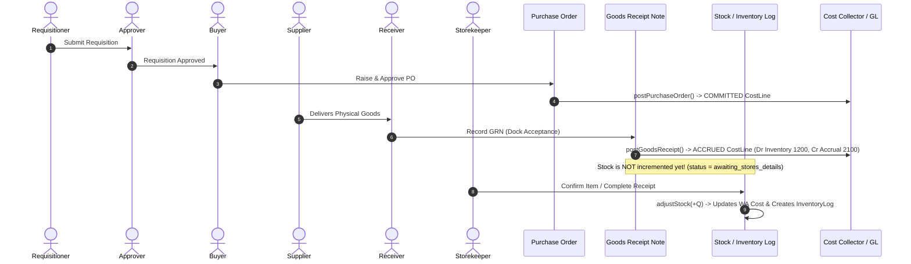
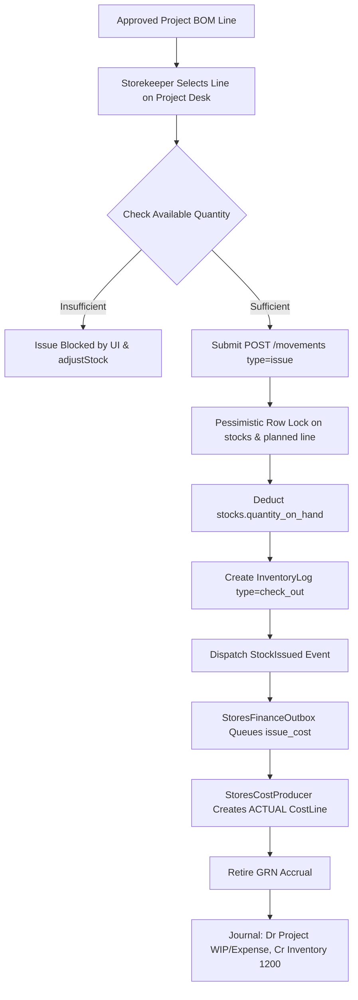

# 68 — WNG ERP Stores Module: Actual Workflow, Backend & Integration Audit

**Date:** 2026-09-30  
**Status:** COMPLETE READ-ONLY AUDIT — NO REDESIGN IMPLEMENTED  
**Target Module:** Procurement & Stores (`ERP-Backend` and `ERP-Frontend`)  
**Companion Documents:** Reports 60, 61, 63, 65, 66, 67 (Finance Redesign Series)

---

## 1. Executive Summary

This report is a rigorous, evidence-based audit of the current **WNG ERP Stores Module** prior to any redesign. The investigation was strictly **READ-ONLY**: no business rules were modified, no migrations were executed, no database records were changed, and no frontend or backend redesign was undertaken.

### Key Discoveries at a Glance

1. **Dual Inventory Mechanism:**
   - **Consumable & Standard Materials:** Tracked by aggregated quantity on a single row in the `stocks` table per material. Moving weighted average cost is recomputed on each priced receipt and stored in `library_materials.unit_cost`.
   - **Board Materials (reusable/dimension pieces):** Tracked individually on the `boards` table (QR code, tracking code, dimensions, condition grade, lifecycle state). Board stock in the master inventory is derived dynamically from `boards` rows where `status IN ('Available', 'Quarantine')`.
2. **Single Movement Bottleneck:**
   - All standard stock movements (receive, issue, return, damage) route through `POST /api/procurement-stores/movements` handled by `StockMovementPoster::post()` and `InventoryService::adjustStock()`, protected by database transactions and pessimistic row locks (`lockForUpdate()`).
   - Boards bypass `StockMovementPoster` during issue: they use `POST /api/procurement-stores/board-requests/{id}/fulfil` directly.
3. **GRN vs. Stock Distinction:**
   - Delivery acceptance at the dock (`POST /api/procurement-stores/goods-receipt-notes`) does **NOT** increment stock. It creates a GRN in `pending_confirmation` and GRN items in `awaiting_stores_details` (or `awaiting_inspection` / `awaiting_material_setup`).
   - Stock is only increased when Stores confirms the line via `StockMovementPoster::postReceipt()` (completing from the receiving queue) or `GoodsReceiptNoteController::confirmItem()`.
4. **Finance Integration Architecture:**
   - On GRN creation: `GoodsReceiptRecorded` fires `ProcurementCostProducer::postGoodsReceipt()`, creating an **ACCRUED** `CostLine` (Dr Raw-material Inventory `1200`, Cr Accrued Expenses `2100`).
   - On Stores Issue: `StockIssued` fires `StoresCostProducer::postStockIssue()`, creating an **ACTUAL** `CostLine` (Dr Project WIP/Expense, Cr Raw-material Inventory `1200`) and **retiring the GRN accrual**.
   - On Stores Return: `StockReturned` fires `StoresCostProducer::postStockReturn()`, creating a signed negative **ACTUAL** `CostLine`.
5. **Critical Control Gaps Identified:**
   - **Hard Deletes on Stock Ledger:** `ProcurementStoresController::destroyLog()` hard-deletes `inventory_logs` records and directly decrements/increments `stock.quantity_on_hand` without logging a reversal movement, stranding Finance `CostLine` records and GL entries.
   - **Warehouse Locations Are Cosmetic:** The `stocks` table has a strict unique constraint on `material_id`. `warehouse_code` is a cosmetic string column overwritten by the latest movement. There is **no multi-warehouse balance table** and **no stock transfer workflow**.
   - **Valuation Data Starvation:** In real rehearsal data, 97.9% of catalogue materials (429 of 438) have zero or negative unit cost, forcing Finance issues to fall back to project budget planned rates.
   - **Role-Name Authorization Debt:** `BoardController` and `BoardRequestController` contain 18 endpoints checking raw role name strings (`hasAnyRole(['Production', 'Stores', 'Manager', 'Super Admin'])`) rather than permissions.

---

## 2. Scope & Safety

- **Read-Only Verification:** All inspections were performed via direct code inspection, static analysis, and non-mutating database queries against the isolated rehearsal environment (`wng_target_rehearsal`).
- **Safety Assertions:**
  - Zero production database mutations.
  - Zero live stock movements, receipts, issues, or adjustments executed.
  - Zero permissions modified.
  - Zero code changes committed.
  - Working tree preserved exactly as received.

---

## 3. Git / Repository Baseline

| Repository | Path | Branch | HEAD SHA | Remote / Origin | Working Tree Status | Unmerged Finance Work |
|---|---|---|---|---|---|---|
| **Backend** | `/home/cosmas/projects/ERP-Backend` | `finance/frontend-stream-f-payroll-finance` | `55d756d` | `git@github.com:woodnorkgreen-tech/ERP-Backend.git` | Modified files in `app/Constants/`, `routes/api.php`, uncommitted payroll finance migrations & tests | **PRESENT** (Stream F Payroll Finance active work in working tree) |
| **Frontend** | `/home/cosmas/projects/ERP-Frontend` | `finance/frontend-stream-f-payroll-finance` | `2fc96c8` | `git@github.com:woodnorkgreen-tech/ERP-Frontend.git` | Modified files in `src/modules/finance/navigation.ts`, `src/router/finance.ts` | **PRESENT** (Stream F Payroll Finance active work in working tree) |

> [!CAUTION]
> Neither branch should be switched or hard-reset. The working tree in both repositories contains active, unmerged Stream F Payroll Finance feature work.

---

## 4. Stores Navigation Hierarchy

Navigation is defined centrally in `/home/cosmas/projects/ERP-Frontend/src/modules/procurement-stores/navigation.ts`. The module exposes two workspaces: **Stores** and **Procurement**.

```text
Stores Workspace (/stores)
├── Overview Group
│   └── Inventory overview (/stores/dashboard)
├── Material Catalogue Group
│   └── Material catalogue (/stores/materials-library) [Access: library]
├── Inventory & Project Requests Group
│   ├── Stock on hand (/stores/inventory)
│   ├── Board tracking (/stores/boards) [Access: library]
│   │   └── Board detail / QR scan (/stores/boards/:trackingCode) [Detail route]
│   └── Project material requests (/stores/project-materials)
├── Stock Movements Group
│   ├── Inventory movements (/stores/operations)
│   └── Receipt confirmation (/stores/goods-receipt-confirmation)
└── Checks & Reports Group
    ├── Quality inspections (/stores/inspections)
    ├── Physical stock counts (/stores/stock-counts)
    ├── Inventory exceptions & alerts (/stores/alerts)
    └── Inventory ledger & reports (/stores/reports)
```

### Procurement Workspace Navigation (`/procurement`)
```text
Procurement Workspace (/procurement)
├── Purchasing overview (/procurement/dashboard)
├── What needs buying (/procurement/replenishment)
├── Purchase requisitions (/procurement/requisitions)
├── Purchase orders (/procurement/purchase-orders)
├── Deliveries (GRN) (/procurement/goods-receipt-notes)
├── Supplier invoices (/procurement/billing)
└── Suppliers (/procurement/suppliers)
```

---

## 5. Frontend Routes Inventory

Extracted from `/home/cosmas/projects/ERP-Frontend/src/modules/procurement-stores/routes.ts`:

| Route Path | Route Name | Component File | Meta Guard | Purpose | Active Status |
|---|---|---|---|---|---|
| `/stores` | — | Redirect to `stores-dashboard` | `requiresAuth` | Root redirect | ACTIVE |
| `/stores/dashboard` | `stores-dashboard` | `views/stores/Dashboard.vue` | `requiresStoresAccess` | Stores operational dashboard & KPI center | ACTIVE |
| `/stores/materials-library` | `stores-materials-library` | `materials-library/views/MaterialsLibraryIndex.vue` | `requiresMaterialsLibraryAccess` | Master Material Catalogue | ACTIVE |
| `/stores/inventory` | `stores-inventory` | `views/stores/StockOnHand.vue` | `requiresStoresAccess` | Stock balances, bins, min levels | ACTIVE |
| `/stores/operations` | `stores-operations` | `views/stores/OperationsDesk.vue` | `requiresStoresAccess` | Universal movement desk (receive/issue/return/damage) | ACTIVE |
| `/stores/project-materials` | `stores-project-materials` | `views/stores/ProjectMaterialsDesk.vue` | `requiresStoresAccess` | Project BOM material requests & issue | ACTIVE |
| `/stores/check-in` | `stores-check-in` | Redirect → `/stores/operations?action=receive` | `requiresStoresAccess` | Legacy receive redirect | ACTIVE (Redirect) |
| `/stores/batch-check-in` | `stores-batch-check-in` | Redirect → `/stores/operations?action=receive&lines=many` | `requiresStoresAccess` | Legacy batch receive redirect | ACTIVE (Redirect) |
| `/stores/goods-receipt-confirmation` | `stores-goods-receipt-confirmation` | `views/stores/GoodsReceiptConfirmation.vue` | `requiresStoresAccess` | GRN dock acceptance confirmation | ACTIVE |
| `/stores/check-out` | `stores-check-out` | Redirect → `/stores/operations?action=issue` | `requiresStoresAccess` | Legacy issue redirect | ACTIVE (Redirect) |
| `/stores/batch-check-out` | `stores-batch-check-out` | Redirect → `/stores/operations?action=issue&lines=many` | `requiresStoresAccess` | Legacy batch issue redirect | ACTIVE (Redirect) |
| `/stores/returns` | `stores-returns` | Redirect → `/stores/project-materials?mode=return` | `requiresStoresAccess` | Legacy returns redirect | ACTIVE (Redirect) |
| `/stores/defective` | `stores-defective` | Redirect → `/stores/operations?action=damage` | `requiresStoresAccess` | Legacy scrap redirect | ACTIVE (Redirect) |
| `/stores/alerts` | `stores-alerts` | `views/stores/Alerts.vue` | `requiresStoresAccess` | Low stock, defective & expired items | ACTIVE |
| `/stores/reports` | `stores-reports` | `views/stores/Reports.vue` | `requiresStoresAccess` | Inventory movement ledger, UOM report, export | ACTIVE |
| `/stores/stock-counts` | `stores-stock-counts` | `views/stores/StockCounts.vue` | `requiresStoresAccess` | Opening inventory & cycle counts | ACTIVE |
| `/stores/inspections` | `stores-inspections` | `views/stores/ReceiptInspections.vue` | `requiresStoresAccess` | Delivery inspection resolution | ACTIVE |
| `/stores/boards` | `stores-board-tracking` | `views/stores/BoardTracking.vue` | `requiresMaterialsLibraryAccess` | Board fleet tracking & status | ACTIVE |
| `/stores/boards/:trackingCode` | `board-scan` | `views/stores/BoardScan.vue` | `requiresAuth` | Mobile QR scan board lookup | ACTIVE |

---

## 6. Frontend Component Inventory

Significant Stores Vue components located in `src/modules/procurement-stores/`:

| Component | Route / Parent | Purpose | Key API Calls | Status |
|---|---|---|---|---|
| `Dashboard.vue` | `/stores/dashboard` | Main KPI overview, quick actions, recent movements | `/boards/command-center-metrics`, `/inventory-logs`, `/board-requests`, `/goods-receipt-notes/pending-confirmations-count` | ACTIVE |
| `StockOnHand.vue` | `/stores/inventory` | Tabular stock register, bin location & reorder point editing | `/inventory`, `/bulk-stock-settings`, `/update-settings` | ACTIVE |
| `OperationsDesk.vue` | `/stores/operations` | Multi-line receive, issue, return, write-off desk | `/movements`, `/goods-receipt-notes/receiving-queue` | ACTIVE |
| `ProjectMaterialsDesk.vue` | `/stores/project-materials` | Project BOM fulfilment, board request/fulfilment, returns, finance exception resolution | `/projects/enquiries/{id}/materials`, `/movements`, `/boards/job/{ref}`, `/board-requests`, `/finance-sync-exceptions` | ACTIVE |
| `GoodsReceiptConfirmation.vue` | `/stores/goods-receipt-confirmation` | Matches dock-accepted GRN lines to catalogue and confirms to stock | `/goods-receipt-notes/pending-confirmations`, `/goods-receipt-note-items/{id}/confirm` | ACTIVE |
| `StockCounts.vue` | `/stores/stock-counts` | Physical stock count entry, approval, Stores reset | `/stock-counts`, `/stock-counts/{id}/approve`, `/stores-reset/preview`, `/stores-reset` | ACTIVE |
| `ReceiptInspections.vue` | `/stores/inspections` | Reviews damaged/quarantined dock receipts | `/goods-receipt-inspections`, `/goods-receipt-inspections/{id}/resolve` | ACTIVE |
| `Alerts.vue` | `/stores/alerts` | Defective items, low stock alerts, expired lots | `/inventory`, `/inventory-logs?type=defective` | ACTIVE |
| `Reports.vue` | `/stores/reports` | Transaction log audit, material ledger, outstanding reusables, PDF download | `/inventory-logs`, `/outstanding-reusables`, `/material-ledger`, `/inventory-logs/pdf` | ACTIVE |
| `BoardTracking.vue` | `/stores/boards` | Grid/list view of tracked boards, status filters, offcut creation | `/boards`, `/boards/command-center-metrics`, `/boards/available` | ACTIVE |
| `BoardScan.vue` | `/stores/boards/:code` | Single board mobile inspection & transition | `/boards/by-code/{code}`, `/boards/{id}/transition` | ACTIVE |
| `ReceiveStockModal.vue` | Component modal | Quick check-in modal used across desks | `/inventory`, `/movements` | ACTIVE |
| `StockSettingsModal.vue` | Component modal | Edit bin, reorder point, warehouse code | `/update-settings` | ACTIVE |
| `BoardQRModal.vue` | Component modal | Print QR code labels for boards | `/boards/{id}/confirm-label` | ACTIVE |
| `MaterialPicker.vue` | Reusable component | Autocomplete material selector with availability indicators | `/inventory`, `/material-options` | ACTIVE |

---

## 7. Frontend API Contract Matrix

| Frontend Call | Method | Backend Route | Controller & Action | Service & Method | Models / Tables Affected | Auth & Permission Guard |
|---|---|---|---|---|---|---|
| `fetchInventory` | GET | `/api/procurement-stores/inventory` | `ProcurementStoresController@inventory` | `InventoryValuationService@valueOf` | `library_materials`, `stocks`, `boards` | `auth:sanctum` |
| `submitMovements` | POST | `/api/procurement-stores/movements` | `StockMovementController@store` | `StockMovementPoster@post` → `InventoryService@adjustStock` | `stocks`, `inventory_logs`, `library_materials`, `boards` | `can:stores.manage` |
| `confirmGrnItem` | POST | `/api/procurement-stores/goods-receipt-note-items/{id}/confirm` | `GoodsReceiptNoteController@confirmItem` | `InventoryService@adjustStock` | `goods_receipt_note_items`, `stocks`, `inventory_logs` | `permission:stores.manage` |
| `createStockCount` | POST | `/api/procurement-stores/stock-counts` | `StockCountController@store` | `StockCountService` | `stock_counts`, `stock_count_items` | `can:stores.manage` |
| `approveStockCount` | POST | `/api/procurement-stores/stock-counts/{id}/approve` | `StockCountController@approve` | `StockMovementPostingService@postStockCount` | `stock_counts`, `stocks`, `journal_entries` | `can:stores.review` |
| `raiseBoardRequest` | POST | `/api/procurement-stores/board-requests` | `BoardRequestController@store` | `BoardWorkflowService@onRequestRaised` | `board_requests`, `stocks` (`increment quantity_reserved`), `inventory_logs` | Role-name: `Production`, `Stores`, `Manager`, `Super Admin` |
| `fulfilBoardRequest` | POST | `/api/procurement-stores/board-requests/{id}/fulfil` | `BoardRequestController@fulfil` | Direct mutation & event | `board_requests`, `boards`, `stocks`, `inventory_logs` | Role-name: `Stores`, `Super Admin` |
| `saveReconciliation` | POST | `/api/procurement-stores/boards/reconciliation` | `BoardController@saveReconciliation` | Direct DB insert | `board_reconciliations` | `auth:sanctum` |
| `recordValuation` | POST | `/api/procurement-stores/boards/record-valuation` | `BoardController@recordValuation` | `BoardValuationService@record` | `boards`, `library_materials` | Role-name: 7 role strings |
| `resolveFinanceValuation` | POST | `/api/procurement-stores/finance-sync-exceptions/{id}/resolve-valuation` | `ProcurementStoresController@resolveFinanceValuation` | `StoresFinanceOutbox@processSynchronously` | `stores_finance_postings`, `inventory_logs`, `boards` | `allows(stores.manage, finance.reports.view)` |
| `destroyLog` | DELETE | `/api/procurement-stores/inventory-logs/{id}` | `ProcurementStoresController@destroyLog` | Direct deletion & stock decrement | `inventory_logs` (hard delete), `stocks` | `allows(stores.manage)` |

---

## 8. Backend Routes Discovery

All routes registered under prefix `api/procurement-stores` (defined in `app/Modules/ProcurementStores/Routes/api.php`):

| Method | Endpoint | Controller Action | Middleware / Permission | Purpose |
|---|---|---|---|---|
| GET | `/readiness` | `OperationsReadinessController@show` | none | Readiness health check |
| POST | `/inventory/check-availability` | `ProcurementStoresController@checkAvailability` | `auth:sanctum` | Check stock sufficiency |
| GET | `/inventory` | `ProcurementStoresController@inventory` | `auth:sanctum` | Master stock & catalogue position |
| GET | `/inventory/{material}/control-options` | `ProcurementStoresController@controlOptions` | `auth:sanctum` | Lots and serial numbers for item |
| POST | `/movements` | `StockMovementController@store` | `auth:sanctum` | Unified movement entrypoint |
| POST | `/check-in` | `ProcurementStoresController@checkIn` | `auth:sanctum` | Legacy single check-in adapter |
| POST | `/check-out` | `ProcurementStoresController@checkOut` | `auth:sanctum` | Legacy single check-out adapter |
| POST | `/batch-check-in` | `ProcurementStoresController@batchCheckIn` | `auth:sanctum` | Legacy batch check-in adapter |
| POST | `/batch-check-out` | `ProcurementStoresController@batchCheckOut` | `auth:sanctum` | Legacy batch check-out adapter |
| POST | `/update-settings` | `ProcurementStoresController@updateStockSettings` | `can:stores.manage` / `stores.adjust_quantity` | Update bin, reorder point, stock count |
| POST | `/bulk-stock-settings` | `ProcurementStoresController@bulkStockSettings` | `can:stores.manage` | Bulk update min level / bin |
| POST | `/returns` | `ProcurementStoresController@returns` | `auth:sanctum` | Legacy project return adapter |
| POST | `/defective` | `ProcurementStoresController@markDefective` | `auth:sanctum` | Legacy scrap adapter |
| GET | `/inventory-logs` | `ProcurementStoresController@inventoryLogs` | `auth:sanctum` | Filtered movement ledger |
| GET | `/inventory-logs/pdf` | `ProcurementStoresController@inventoryLogsPdf` | `auth:sanctum` | Movement ledger PDF export |
| GET | `/material-ledger` | `ProcurementStoresController@materialLedger` | `auth:sanctum` | Per-material running balance ledger |
| GET | `/outstanding-reusables` | `ProcurementStoresController@outstandingReusables` | `auth:sanctum` | Outstanding unreturned items |
| GET | `/material-demand-forecast` | `ProcurementStoresController@materialDemandForecast` | `allows(stores.manage, procurement.view)` | Planned vs stocked demand forecast |
| GET | `/replenishment-suggestions` | `ReplenishmentController@index` | `auth:sanctum` | Materials below minimum or short on job |
| POST | `/replenishment-suggestions/draft-requisition` | `ReplenishmentController@draft` | `auth:sanctum` | Convert shortages to draft requisition |
| GET | `/finance-sync-exceptions` | `ProcurementStoresController@financeSyncExceptions` | `allows(stores.manage, finance.reports.view)` | Unposted/failed Stores finance outbox |
| POST | `/finance-sync-exceptions/{id}/retry` | `ProcurementStoresController@retryFinanceSync` | `allows(stores.manage, finance.reports.view)` | Retry failed finance outbox job |
| POST | `/finance-sync-exceptions/{id}/resolve-valuation` | `ProcurementStoresController@resolveFinanceValuation` | `allows(stores.manage, finance.reports.view)` | Price unvalued issue and re-post |
| DELETE | `/inventory-logs/{id}` | `ProcurementStoresController@destroyLog` | `allows(stores.manage)` | Hard-delete log and mutate stock |
| POST | `/inventory-logs/{id}/link-project-material` | `ProcurementStoresController@linkProjectMaterial` | `allows(stores.manage)` | Retrospectively link movement to BOM line |
| GET | `/stock-counts` | `StockCountController@index` | `auth:sanctum` | List physical stock counts |
| POST | `/stock-counts` | `StockCountController@store` | `can:stores.manage` | Initialize new stock count |
| GET | `/stock-counts/{id}` | `StockCountController@show` | `auth:sanctum` | Stock count line items & variances |
| PUT | `/stock-counts/{id}` | `StockCountController@update` | `can:stores.manage` | Update counted quantities |
| POST | `/stock-counts/{id}/submit` | `StockCountController@submit` | `can:stores.manage` | Submit count for review |
| POST | `/stock-counts/{id}/approve` | `StockCountController@approve` | `can:stores.review` | Approve count and post GL journal |
| POST | `/stock-counts/{id}/reject` | `StockCountController@reject` | `can:stores.review` | Reject count back to draft |
| DELETE | `/stock-counts/{id}` | `StockCountController@destroy` | `can:stores.manage` | Delete unapproved count |
| GET | `/stores-reset/preview` | `StoresResetController@preview` | Role: `Super Admin` | Preview complete wipe of stores |
| POST | `/stores-reset` | `StoresResetController@store` | Role: `Super Admin` | Execute complete wipe of stores |
| GET | `/goods-receipt-inspections` | `GoodsReceiptInspectionController@index` | Role: `Stores`, `Manager`, `Super Admin` | Dock inspection queue |
| POST | `/goods-receipt-inspections/{id}/resolve` | `GoodsReceiptInspectionController@resolve` | Role: `Stores`, `Manager`, `Super Admin` | Resolve inspection (accept/quarantine/reject) |
| GET | `/goods-receipt-notes/receiving-queue` | `GoodsReceiptNoteController@receivingQueue` | Role: `Stores`, `Manager`, `Super Admin` | GRN items waiting for Stores details |
| GET | `/goods-receipt-notes/pending-confirmations` | `GoodsReceiptNoteController@pendingConfirmations` | `auth:sanctum` | GRNs waiting store confirmation |
| POST | `/goods-receipt-note-items/{id}/confirm` | `GoodsReceiptNoteController@confirmItem` | `permission:stores.manage` | Confirm GRN item into stock |
| POST | `/goods-receipt-notes` | `GoodsReceiptNoteController@store` | `auth:sanctum` | Dock receipt entry |
| DELETE | `/goods-receipt-notes/{id}` | `GoodsReceiptNoteController@destroy` | Role: `Super Admin` | Delete receipt if unlinked |
| GET | `/board-requests` | `BoardRequestController@index` | `auth:sanctum` | List board requests |
| POST | `/board-requests` | `BoardRequestController@store` | Role: `Production`, `Stores`, `Manager`, `Super Admin` | Create board request & reserve |
| POST | `/board-requests/{id}/fulfil` | `BoardRequestController@fulfil` | Role: `Stores`, `Super Admin` | Issue physical boards to job |
| DELETE | `/board-requests/{id}` | `BoardRequestController@cancel` | Role: `Production`, `Stores`, `Manager`, `Super Admin` | Cancel request & release reservation |
| GET | `/boards` | `BoardController@index` | `auth:sanctum` | List all tracked boards |
| POST | `/boards/ingest` | `BoardController@ingest` | Role: `Stores`, `Super Admin` | Register boards from catalogue |
| GET | `/boards/by-code/{code}` | `BoardController@showByCode` | `auth:sanctum` | QR scan lookup |
| POST | `/boards/{id}/start-processing` | `BoardController@startProcessing` | Role: `Production`, `Stores`, `Manager`, `Super Admin` | Transition Allocated → At Station → WIP |
| POST | `/boards/{id}/consume` | `BoardController@consume` | Role: `Production`, `Stores`, `Manager`, `Super Admin` | Consume board & register offcut |
| POST | `/boards/record-valuation` | `BoardController@recordValuation` | Role: 7 role strings | Price unvalued board batch |
| POST | `/boards/reconciliation` | `BoardController@saveReconciliation` | `auth:sanctum` | Save board physical audit session |

---

## 9. Data Model & Database Tables

### Master Entity Map

| Model | Table | Primary Purpose | Soft Deletes? | Audit Trait? | Authoritative For |
|---|---|---|---|---|---|
| `LibraryMaterial` | `library_materials` | Master catalogue item identity, tracking mode, UOM conversions, weighted average cost | YES | Creator/Updater | Material Identity, Specifications, Base UOM, WA Cost |
| `Stock` | `stocks` | Aggregated physical quantity on hand, quantity reserved, and min stock level | YES | None | Physical Balance & Soft Reservations for Consumables |
| `InventoryLog` | `inventory_logs` | Immutable audit ledger of all stock additions, deductions, allocations, returns | **NO** | `user_id` logged | Authoritative Transaction Audit Ledger |
| `Board` | `boards` | Physical individual sheet record (QR, dimensions, status, grade, value) | YES | Movements tracked | Authoritative Board Fleet Identity & Physical Status |
| `BoardMovement` | `board_movements` | History of board transitions (Allocated, At Station, WIP, Consumed, Scrapped) | NO | Performer logged | Board Custody Audit Trail |
| `BoardRequest` | `board_requests` | Workshop demand for boards against a specific job | NO | Requester/Fulfilled By | Board Job Reservations |
| `GoodsReceiptNote` | `goods_receipt_notes` | Delivery docket matched to purchase order | NO | Received By | Delivery Header & Supplier Acceptance |
| `GoodsReceiptNoteItem` | `goods_receipt_note_items` | Delivered line items, received quantity, condition, dock acceptance status | NO | Confirmed By | Line Delivery Acceptance & Stock Bridge |
| `GoodsReceiptInspection`| `goods_receipt_inspections`| Quality control decision on received goods (accepted vs quarantined vs rejected) | NO | Inspector logged | Quality Decision & Accepted Quantity |
| `StockCount` | `stock_counts` | Physical stock take count header (opening vs cycle) | NO | Counter, Approver | Physical Count Session & Approval |
| `StockCountItem` | `stock_count_items` | Counted lines with system balance, counted balance, and variance | NO | None | Count Variance per Material |
| `StoresFinancePosting` | `stores_finance_postings` | Outbox for async GL/cost-line dispatch from Stores events | NO | Retry / Error logs | Stores → Finance Posting State & Errors |

### Key Column Schemas

#### `stocks` Table Schema
```sql
CREATE TABLE `stocks` (
  `id` bigint unsigned NOT NULL AUTO_INCREMENT,
  `material_id` bigint unsigned NOT NULL,
  `quantity_on_hand` decimal(15,2) NOT NULL DEFAULT '0.00',
  `quantity_reserved` decimal(15,2) NOT NULL DEFAULT '0.00',
  `min_stock_level` decimal(15,2) NOT NULL DEFAULT '0.00',
  `warehouse_code` varchar(255) COLLATE utf8mb4_unicode_ci NOT NULL DEFAULT 'MAIN',
  `location_bin` varchar(255) COLLATE utf8mb4_unicode_ci DEFAULT NULL,
  `tracking_mode` varchar(50) COLLATE utf8mb4_unicode_ci NOT NULL DEFAULT 'by_count',
  `created_at` timestamp NULL DEFAULT NULL,
  `updated_at` timestamp NULL DEFAULT NULL,
  `deleted_at` timestamp NULL DEFAULT NULL,
  PRIMARY KEY (`id`),
  UNIQUE KEY `stocks_material_id_unique` (`material_id`),
  CONSTRAINT `stocks_material_id_foreign` FOREIGN KEY (`material_id`) REFERENCES `library_materials` (`id`) ON DELETE CASCADE
);
```

#### `inventory_logs` Table Schema
```sql
CREATE TABLE `inventory_logs` (
  `id` bigint unsigned NOT NULL AUTO_INCREMENT,
  `material_id` bigint unsigned NOT NULL,
  `user_id` bigint unsigned DEFAULT NULL,
  `type` enum('check_in','check_out','return','defective','adjustment','allocated') COLLATE utf8mb4_unicode_ci NOT NULL,
  `batch_number` varchar(100) COLLATE utf8mb4_unicode_ci DEFAULT NULL,
  `lot_number` varchar(100) COLLATE utf8mb4_unicode_ci DEFAULT NULL,
  `expiry_date` date DEFAULT NULL,
  `inventory_lot_id` bigint unsigned DEFAULT NULL,
  `inventory_serial_item_id` bigint unsigned DEFAULT NULL,
  `quantity` decimal(15,2) NOT NULL,
  `entered_quantity` decimal(15,6) DEFAULT NULL,
  `entered_uom_id` bigint unsigned DEFAULT NULL,
  `uom_conversion_factor` decimal(15,6) DEFAULT NULL,
  `receipt_unit_cost` decimal(15,4) DEFAULT NULL,
  `balance_after` decimal(15,2) NOT NULL,
  `project_id` bigint unsigned DEFAULT NULL,
  `project_material_id` bigint unsigned DEFAULT NULL,
  `original_issue_log_id` bigint unsigned DEFAULT NULL,
  `return_kind` varchar(50) COLLATE utf8mb4_unicode_ci DEFAULT NULL,
  `supplier_id` bigint unsigned DEFAULT NULL,
  `reference_no` varchar(255) COLLATE utf8mb4_unicode_ci DEFAULT NULL,
  `unit_price` decimal(15,2) DEFAULT NULL,
  `recipient_name` varchar(255) COLLATE utf8mb4_unicode_ci DEFAULT NULL,
  `notes` text COLLATE utf8mb4_unicode_ci,
  `usage_type` varchar(50) COLLATE utf8mb4_unicode_ci NOT NULL DEFAULT 'consumable',
  `logged_at` datetime NOT NULL,
  `created_at` timestamp NULL DEFAULT NULL,
  `updated_at` timestamp NULL DEFAULT NULL,
  PRIMARY KEY (`id`),
  KEY `inventory_logs_material_id_foreign` (`material_id`),
  KEY `inventory_logs_user_id_foreign` (`user_id`),
  KEY `inventory_logs_project_id_foreign` (`project_id`),
  KEY `inventory_logs_original_issue_log_id_foreign` (`original_issue_log_id`)
);
```

---

## 10. Authoritative Inventory Source of Truth

The codebase implements a **hybrid architecture** that bifurcates between consumables and individually tracked boards:

### 1. Consumable and Bulk Quantity Materials
- **Quantity on Hand:** Authoritative value resides in `stocks.quantity_on_hand`.
- **Reserved Quantity:** Authoritative value resides in `stocks.quantity_reserved`.
- **Available Quantity:** Calculated formula:  
  $$\text{Available} = \max(0, \text{stocks.quantity\_on\_hand} - \text{stocks.quantity\_reserved})$$
- **Balance Floor Enforcement:** Validated within `InventoryService::adjustStock()` under a pessimistic row lock (`lockForUpdate()`). Deductions that would drive $\text{quantity\_on\_hand} < \text{quantity\_reserved}$ throw a `ValidationException`.

### 2. Board-Tracked Materials (`isBoardTrackable()`)
- **Quantity on Hand:** Derived dynamically from the `boards` table:  
  $$\text{On Hand} = \text{COUNT}(\text{boards WHERE status } \in (\text{'Available'}, \text{'Quarantine'}))$$
- **Available Quantity:** Derived dynamically from:  
  $$\text{Available} = \max(0, \text{COUNT}(\text{boards WHERE status} = \text{'Available'}) - \text{stocks.quantity\_reserved})$$
- Note: Although `stocks.quantity_on_hand` also exists for board materials, `ProcurementStoresController::inventory()` explicitly overrides the stock row reading with the dynamic count from the `boards` table to avoid counting ungraded Quarantine boards.

---

## 11. Stock Balance Formula

### Backend Mathematical Logic (Consumables)
In `InventoryService::adjustStock()`:
$$\text{New On Hand} = \text{Previous On Hand} + \Delta Q$$
Where $\Delta Q$ is:
- $+Q$ for `check_in` (receipts)
- $-Q$ for `check_out` (issues)
- $+Q$ for `return` (returns from projects)
- $-Q$ for `defective` (damage / scrap)
- $\pm \Delta Q$ for `adjustment` (stock count variance)

### Discrepancy Risk Between Ledger and Stock Row
Because `stocks.quantity_on_hand` is stored as an aggregated scalar rather than being a pure SQL view over `inventory_logs`, direct mutations (such as in `destroyLog()`) can cause the stock balance to drift from the ledger sum.

**Rehearsal Proof:** In the rehearsal database, **16 out of 33 stocked materials** exhibit discrepancies between `stocks.quantity_on_hand` and `SUM(inventory_logs.quantity)`.

---

## 12. Inventory Item Master (`LibraryMaterial`)

Inventory items originate in the **Materials Library** (`library_materials` table).

- **Key Fields:** `material_code`, `material_name`, `category`, `material_category_id`, `material_type` (`consumable` / `reusable`), `item_status` (`Active`, `Inactive`, `Discontinued`, `Blocked`, `Under Review`), `tracking_mode` (`bulk_quantity`, `lot_batch`, `serialized_item`, `dimension_piece`), `issue_disposition` (`consumed`, `returnable`, `recoverable_remainder`), `base_uom_id`, `purchase_uom_id`, `issue_uom_id`, `unit_cost` (moving weighted average), `default_unit_cost`.
- **Governance:** Managed via `MaterialsLibrary` permissions (`materials_library.manage`).
- **Activation Gate:** Items must have `item_status = 'Active'` to be received or issued. Non-active items are blocked by `InventoryService::adjustStock()`.
- **Deletion Safety:** Uses `SoftDeletes`. Hard delete via `MaterialController::forceDelete` is blocked if foreign keys in `stocks`, `inventory_logs`, or `purchase_order_items` exist.

---

## 13. Locations & Warehouses

### Actual Implementation vs. Operational Perception

- **No Multi-Warehouse Balances:** The ERP has **NO** warehouse table, **NO** location balance table, and **NO** multi-warehouse inventory tracking.
- **Single Global Balance:** The `stocks` table contains a unique constraint on `material_id` alone (`stocks_material_id_unique`).
- **Cosmetic Fields:**
  - `stocks.warehouse_code`: A string default (`'MAIN'`) overwritten by the last transaction's location string.
  - `stocks.location_bin`: A free-text string (e.g. `"Shelf B-3"`) representing physical bin placement.
- **GRN Store Location:** The GRN creation form enforces an enum dropdown:
  `store_location IN ('Karen Village Store', 'Matasia Store', 'Mombasa Store', 'Gichagi Store')`.
  However, this value only records the delivery destination on the GRN document; it does not segregate inventory balances in the database.

---

## 14. Procurement → Stores Workflow



---

## 15. GRN Ownership & Permissions

- **Creation Actor:** Procurement / Receiving staff create GRNs via `POST /api/procurement-stores/goods-receipt-notes`.
- **Stores Confirmation Actor:** Storekeeper confirms dock-accepted items into stock via `POST /api/procurement-stores/goods-receipt-note-items/{id}/confirm` (protected by `permission:stores.manage`) or via `StockMovementPoster::postReceipt()`.
- **Immutability:** Once created, a GRN cannot be edited (`PUT /goods-receipt-notes/{id}` returns HTTP 422: *"Posted goods receipts are immutable. Record a return or a new receipt instead"*).
- **Deletion Restrictions:** Hard deletion via `DELETE /goods-receipt-notes/{id}` is restricted to `Super Admin`. It is strictly blocked if:
  1. Any item has entered the Finance Cost Ledger (`CostLine` exists).
  2. Any line has posted stock still sitting on the shelf (`quantity_on_hand > 0`).
  3. A matched or verified supplier Bill exists against the Purchase Order.

---

## 16. GRN Quantity Controls

- **Over-delivery Prevention:** `GoodsReceiptNoteController::store()` locks the parent `PurchaseOrder` and computes:
  $$\text{Remaining} = \text{po\_item.quantity} - \sum \text{accepted received\_quantity}$$
  If $\text{received\_quantity} > \text{Remaining}$, the transaction aborts with HTTP 422.
- **Short / Partial Deliveries:** Fully supported. The PO line tracks total accepted quantity across multiple GRNs. The PO remains available in `getAvailablePurchaseOrders()` until all lines are fully received.
- **Damaged / Failed Deliveries:** If `quality_check === 'fail'` or item condition is `'damaged'` or `'for_repair'`, line `stock_status` is set to `'awaiting_inspection'`. It cannot enter available stock until formally resolved via `GoodsReceiptInspectionController::resolve()`.

---

## 17. GRN Stock Increment Trigger

Stock increments **ONLY** upon Store Confirmation, never upon dock receipt.

| Trigger Event | Stock Effect | Proof in Code |
|---|---|---|
| PO Approved | None | PO only affects committed spend |
| GRN Created (Dock Entry) | **None** | `GoodsReceiptNoteController::store()` L401-432 sets `stock_status = 'awaiting_stores_details'`; no call to `adjustStock()` |
| Storekeeper Completes from Queue | **+Q on Stock** | `StockMovementPoster::postReceipt()` L129 calls `InventoryService::adjustStock()` |
| Storekeeper Confirms Item | **+Q on Stock** | `GoodsReceiptNoteController::confirmItem()` L717 calls `creditStockForAcceptedItem()` |

**Idempotency Protection:** Both confirmation pathways lock the `goods_receipt_note_items` row and assert that `store_status !== 'confirmed'` and `stock_status !== 'posted'`. A double confirmation attempt fails with a validation error.

---

## 18. GRN Finance Integration Effect

The Stores audit confirms compliance with the established Finance architecture:

1. **PO Approved:** Committed cost line created (`nature: COMMITTED`).
2. **GRN Created:** Accrued cost line created (`nature: ACCRUED`, `source_ref: 'accrual'`).
   - Journal Leg: **Dr Raw-material Inventory (1200)** / **Cr Accrued Expenses (2100)**.
   - Commitment is relieved by the accrued amount.
3. **Bill Verified:** Three-way match settles accrual into Accounts Payable (2000). **No new project cost.**
4. **Stock Issue:** Creates **ACTUAL** material cost line, and retires the GRN accrual.

---

## 19. Service and Non-Stock Items on GRN

- Non-stock or custom PO items (items where `purchase_order_items.material_id IS NULL`) can be received on a GRN.
- In `GoodsReceiptNoteController::store()`, if `$material` is null, the item's `stock_status` is marked as `'not_stocked'`.
- These lines do not enter the Stores receiving queue and never increment physical stock, but their accrual is recorded in Finance.

---

## 20. Material Request Workflow

The system contains two distinct request mechanisms:

1. **Board Material Requests (MRF):**
   $$\text{Raised (Pending)} \xrightarrow{\text{Stock Reserved}} \text{Storekeeper Fulfils} \xrightarrow{\text{Allocated to Job}} \text{Dispatched to Station} \xrightarrow{\text{WIP}} \text{Consumed / Returned}$$
   - Initiated via `POST /api/procurement-stores/board-requests`.
   - Reserves stock in `stocks.quantity_reserved`.
   - Fulfilled via `POST /api/procurement-stores/board-requests/{id}/fulfil`.

2. **Standard / Consumable Project Demands:**
   - Demands originate from the **Project BOM** (`element_materials` table).
   - Once Project Officer and Production sign off (`approval_status.all_approved = true`), the lines appear on the `ProjectMaterialsDesk.vue`.
   - Storekeeper issues against the planned line directly via `POST /api/procurement-stores/movements` (`type: 'issue'`).

---

## 21. Project Material Linkage

- **Linkage Mandatory for Project Issues:** `StockMovementPoster::assertProjectLineCanTake()` requires `project_id` and `project_material_id`.
- **Validation:**
  - Verifies that `project_material_id` belongs to the project's enquiry.
  - Verifies that `library_material_id` matches the catalogue item.
  - Verifies that the BOM material is fully approved (`approval_status.all_approved`).
  - Enforces that net issued quantity cannot exceed approved planned quantity.

---

## 22. Overhead & Departmental Issues

- Stock issues can occur without a project linkage (e.g. workshop maintenance, office use).
- Handled via `OperationsDesk.vue` selecting issue mode without specifying a project.
- **Accounting Effect:** If `project_id` and `reference_no` are omitted, `InventoryService::adjustStock()` suppresses dispatching `StockIssued`. The physical stock decrements, but no project `CostLine` is created.

---

## 23. Material Issue Workflow



---

## 24. Stock Availability Controls & Concurrency

- **Pessimistic Locking:** All stock mutations in `InventoryService::adjustStock()` execute inside a `DB::transaction()` and lock the `stocks` row with `lockForUpdate()`.
- **Negative Stock Guard:**  
  $$\text{Next Quantity} = \text{quantity\_on\_hand} + \Delta Q$$
  $$\text{If } \Delta Q < 0 \text{ and } \text{Next Quantity} < \text{quantity\_reserved}, \text{ ABORT}$$
  This strictly prevents negative physical stock and prevents issuing stock committed to reservations.
- **Race Condition Immunity:** Frontend checks are purely informational; the authoritative availability guard executes inside the database row lock.

---

## 25. Material Issue → Project Costing

- **Event:** `StockIssued` handled by `RecordStockIssueCost` listener.
- **Outbox:** Enqueued in `stores_finance_postings` and processed synchronously via `StoresFinanceOutbox::processSynchronously()`.
- **CostLine Attributes:**
  - `nature`: `ACTUAL`
  - `status`: `VERIFIED`
  - `source_type`: `InventoryLog::class`
  - `source_id`: `$log->id`
  - `source_ref`: `'stock-issue'`
  - `amount`: $\text{quantity} \times \text{unit\_cost}$
- **Accrual Relief:** Immediately retires matching accrued GRN cost lines for that material on the project via `StoresCostProducer::relieveAccrualsFor()`.
- **Established Principle Verified:** **Stores Issue = ACTUAL Project Materials Cost**.

---

## 26. Inventory Valuation Methodology

- **Standard Materials:** **Moving Weighted Average (MWA)**.
  - On each priced receipt:
    $$\text{New Unit Cost} = \frac{(\text{Prior Qty} \times \text{Prior Cost}) + (\text{Received Qty} \times \text{Receipt Cost})}{\text{Prior Qty} + \text{Received Qty}}$$
  - Stored on `library_materials.unit_cost`.
  - Issue cost is frozen onto `inventory_logs.receipt_unit_cost` at the moment of issue.
- **Board Materials:** **Specific Identification**.
  - Valued at the sum of `boards.current_value` for active sheets. Offcuts inherit proportional area value.
- **Valuation Alignment:** `InventoryValuationService::valueOf()` is the single valuation service shared by both Stores inventory summaries and Finance inventory positions.

---

## 27. Material Returns Workflow

- Initiated from `ProjectMaterialsDesk.vue` or `POST /api/procurement-stores/returns`.
- **Validation:**
  - Must reference an `original_issue_log_id`.
  - Original issue must have `usage_type === 'reusable'`.
  - Consumable issues cannot be returned (*"Consumable issues are final and cannot be returned to stock"*).
  - Total returned quantity cannot exceed original issued quantity.
- **Stock Effect:** Increments `stocks.quantity_on_hand` and logs `InventoryLog` with `type = 'return'`.

---

## 28. Return Costing & Reversals

- **Event:** `StockReturned` handled by `RecordStockReturnCredit`.
- **Cost Producer:** `StoresCostProducer::postStockReturn()` creates a **signed negative ACTUAL CostLine** linked to the original issue.
- **Financial Proportionality:**
  $$\text{Credit Amount} = \text{Original Cost} \times \left(\frac{\text{Returned Qty}}{\text{Issued Qty}}\right)$$
- **GL Posting:** Swaps legs: Dr Raw-material Inventory (1200) / Cr Project WIP/Expense.

---

## 29. Damaged, Scrap & Waste Material

- **Defective / Scrap:** Processed via `POST /api/procurement-stores/movements` (`type: 'damage'`).
  - Calls `StockMovementPoster::postDamage()`.
  - Decrements `stocks.quantity_on_hand` and creates `InventoryLog` with `type = 'defective'`.
- **Boards Quarantine & Scrap:**
  - Boards returned damaged enter status `'Quarantine'`.
  - Storekeeper reviews via `POST /boards/{id}/review-quarantine-return` to either:
    1. **Release to Stock:** Status becomes `'Available'` with an accepted recoverable value.
    2. **Scrap:** Status becomes `'Scrapped'` with a mandatory scrap reason code.

---

## 30. Stock Transfers

> [!IMPORTANT]
> **Stock Transfers Do Not Exist:**
> There is no inter-warehouse or inter-store transfer functionality in the current codebase. No tables, routes, services, or models exist for stock transfers. `stocks` is a single-row-per-material global balance.

---

## 31. Stock Adjustments

- Triggered via `POST /api/procurement-stores/update-settings` when `stock_quantity` is modified.
- **Permission:** Requires `permission:stores.adjust_quantity`.
- **Reason Required:** `stock_adjustment_reason` is mandatory.
- **Execution:** Calls `InventoryService::adjustStock()` with `type = 'adjustment'`, creating a traceable `InventoryLog` record.

---

## 32. Physical Stock Counts & Stock Takes

Managed by `StockCountController`:

1. **Count Types:**
   - **Opening Inventory:** Initial inventory count before ledger inception.
   - **Cycle Count:** Routine physical verification.
2. **Workflow:**
   $$\text{Draft (store)} \xrightarrow{\text{Enter Counts (update)}} \text{Submitted (submit)} \xrightarrow{\text{Manager Approves (approve)}} \text{Posted to GL}$$
3. **Accounting Posting:** Handled by `StockMovementPostingService::postStockCount()`:
   - **Opening Inventory:** Dr Raw-material Inventory (1200) / Cr Opening Balance Equity (3000).
   - **Cycle Shortage:** Dr Inventory Adjustments & Shrinkage (5200) / Cr Raw-material Inventory (1200).
   - **Cycle Surplus:** Dr Raw-material Inventory (1200) / Cr Inventory Adjustments & Shrinkage (5200).

---

## 33. Reorder Levels & Low Stock Alerts

- Configured per material on `stocks.min_stock_level`.
- Evaluated dynamically in `ProcurementStoresController::inventory()` and `useInventory.ts`:
  - **Critical:** $\text{Available} = 0$
  - **Low Stock:** $\text{Available} \le \text{min\_stock\_level}$
  - **Optimal:** $\text{Available} > \text{min\_stock\_level}$
- Feeds into `ReplenishmentController@index` to suggest purchasing replenishment.

---

## 34. Inventory Finance Integration Map

| Stores Transaction | Movement Type | CostLine Nature | Debit Account | Credit Account | Triggering Event / Listener |
|---|---|---|---|---|---|
| **GRN Dock Acceptance** | None | `ACCRUED` | Raw-material Inventory (`1200`) | Accrued Expenses (`2100`) | `GoodsReceiptRecorded` → `ProcurementCostProducer` |
| **Stock Issue to Project** | `check_out` | `ACTUAL` | Project Expense / WIP | Raw-material Inventory (`1200`) | `StockIssued` → `StoresCostProducer` |
| **Stock Return to Store** | `return` | `ACTUAL` (-) | Raw-material Inventory (`1200`) | Project Expense / WIP | `StockReturned` → `StoresCostProducer` |
| **Opening Count Approval**| `adjustment` | GL Journal | Raw-material Inventory (`1200`) | Opening Balance Equity (`3000`)| `StockCountController@approve` |
| **Cycle Count Shortage** | `adjustment` | GL Journal | Inventory Adjustments (`5200`) | Raw-material Inventory (`1200`)| `StockCountController@approve` |
| **Cycle Count Surplus** | `adjustment` | GL Journal | Raw-material Inventory (`1200`) | Inventory Adjustments (`5200`)| `StockCountController@approve` |

---

## 35. Stores Valuation vs GL Reconciliation

- **Stores Valuation Endpoint:** `GET /api/procurement-stores/inventory` returns `summary.total_value` (calculated via `InventoryValuationService`).
- **Finance Inventory Position Endpoint:** `GET /api/finance/inventory/position` (implemented in Stream D Report 61) calls the exact same `InventoryValuationService::valuation()`.
- **GL Control Balance:** Calculated from General Ledger account `1200 Raw-material Inventory`.
- **Known Rehearsal Gap:** In historical rehearsal data, prior unposted issues and lack of opening equity journals caused GL 1200 to diverge from physical stock valuation. `StockCountController@approve` was built specifically to reconcile this variance.

---

## 36. Project Costing Integration Matrix

| Stores Event | CostLine Status | Project Cost Effect | GL Effect | Posting Owner |
|---|---|---|---|---|
| **PO Approved** | `VERIFIED` | Increases Committed Spend | None | `ProcurementCostProducer` |
| **GRN Recorded** | `VERIFIED` | Decreases Committed, Increases Accrued | Dr 1200 / Cr 2100 | `ProcurementCostProducer` |
| **Bill Verified** | `VERIFIED` | None (Settles Accrual to AP) | Dr 2100 / Cr 2000 | `JournalPostingService` |
| **Stores Issue** | `VERIFIED` | **Increases ACTUAL Project Cost** (Retires Accrual) | Dr WIP / Cr 1200 | `StoresCostProducer` |
| **Stores Return** | `VERIFIED` | **Decreases ACTUAL Project Cost** | Dr 1200 / Cr WIP | `StoresCostProducer` |
| **Stock Count** | None | None | Inventory vs Equity/Adj | `StockMovementPostingService` |
| **Overhead Issue** | None | None | None | Suppressed if no project |

---

## 37. Asset / Equipment Boundary

- Tools, machinery, and equipment currently reside in `library_materials` with `material_type = 'reusable'`.
- There is no separate fixed asset register in Stores.
- Reusable equipment issued to projects uses the same custody mechanism as reusable materials.

---

## 38. Permissions Matrix

| Permission Constant | Value | Purpose | Assigned Roles in RolePermissions.php |
|---|---|---|---|
| `STORES_VIEW` | `stores.view` | View stock on hand, movements, and reports | `Super Admin`, `Manager`, `Stores`, `Procurement`, `Production`, `Logistics` |
| `STORES_MANAGE` | `stores.manage` | Execute receipts, issues, returns, stock counts | `Super Admin`, `Manager`, `Stores` |
| `STORES_REVIEW` | `stores.review` | Approve physical stock counts & variances | `Super Admin`, `Manager` |
| `STORES_ADJUST_QUANTITY` | `stores.adjust_quantity`| Manually overwrite a counted stock balance | `Super Admin`, `Manager`, `Stores` |
| `MATERIALS_LIBRARY_VIEW` | `materials_library.view` | View catalogue materials and specifications | `Super Admin`, `Manager`, `Stores`, `Procurement`, `Production` |
| `MATERIALS_LIBRARY_MANAGE`| `materials_library.manage`| Create/edit catalogue items, categories, UOM | `Super Admin`, `Manager`, `Stores`, `Procurement` |

---

## 39. Role-Name Authorization Audit

The following table documents all instances where security checks bypass Laravel permissions and evaluate raw role name strings:

| File Location | Line | Checked Role Strings | Security Relevant? | Risk Level |
|---|---|---|---|---|
| `BoardController.php` | 38 | `Stores`, `Super Admin` | Yes (ingest boards) | MEDIUM |
| `BoardController.php` | 259 | `Production`, `Stores`, `Manager`, `Super Admin` | Yes (start processing) | MEDIUM |
| `BoardController.php` | 301 | `Production`, `Stores`, `Manager`, `Super Admin` | Yes (dispatch to station)| MEDIUM |
| `BoardController.php` | 333 | `Production`, `Stores`, `Manager`, `Super Admin` | Yes (add board note) | LOW |
| `BoardController.php` | 424 | `Production`, `Stores`, `Manager`, `Super Admin` | Yes (batch start WIP) | MEDIUM |
| `BoardController.php` | 472 | `Production`, `Stores`, `Manager`, `Super Admin` | Yes (consume board) | HIGH |
| `BoardController.php` | 937 | `Stores`, `Finance`, `Finance Manager`, `Accounts`, `Accountant`, `Manager`, `Super Admin` | Yes (board valuation) | **HIGH** (Contains phantom non-existent roles) |
| `BoardController.php` | 1133 | `Stores`, `Super Admin` | Yes (quarantine review) | HIGH |
| `BoardRequestController.php`| 53 | `Production`, `Stores`, `Manager`, `Super Admin` | Yes (raise request) | MEDIUM |
| `BoardRequestController.php`| 203 | `Stores`, `Super Admin` | Yes (fulfil request) | HIGH |
| `GoodsReceiptNoteController.php`| 32 | `Stores`, `Manager`, `Super Admin` | Yes (view receiving queue)| LOW |
| `GoodsReceiptInspectionController.php`| 20 | `Stores`, `Manager`, `Super Admin` | Yes (resolve inspection)| HIGH |
| `useStoresAccess.ts` (Frontend)| 11-20 | `STORES_WRITE_ROLES` list | Yes (UI route gating) | MEDIUM |

---

## 40. Segregation of Duties

| Operation | Initiator / Preparer | Approver | Executor / Receiver | Segregation Enforced? |
|---|---|---|---|---|
| **Purchase Requisition** | Any User | `Manager` / `Super Admin` | `Procurement` | **YES** (`SelfApproval` check prevents self-approval) |
| **Purchase Order** | `Procurement` | `Manager` / `Super Admin` | Supplier | **YES** (Preparer cannot approve PO) |
| **Goods Receipt (GRN)** | `Procurement` / Dock Staff | None | Stores confirms | **PARTIAL** (Dock receiver and storekeeper can be same user) |
| **Material Issue** | Storekeeper | None (checks BOM approval) | Project Recipient | **NO** (Storekeeper issues without second-person signoff) |
| **Stock Counts** | Storekeeper (`stores.manage`) | Manager (`stores.review`)| GL posted automatically | **YES** (Requires `stores.review` permission) |
| **Stock Adjustments** | Storekeeper | None | Directly applied | **NO** (Storekeeper with `stores.adjust_quantity` can adjust with reason) |

---

## 41. Audit Trail

- **Movement Ledger (`inventory_logs`):** Every stock movement records: `material_id`, `user_id`, `type`, `quantity`, `balance_after`, `project_id`, `reference_no`, `notes`, `logged_at`.
- **Board Movements (`board_movements`):** Tracks every board lifecycle status change (`from_status`, `to_status`, `performed_by`, `ts`, `job_ref`, `notes`, `condition_grade`).
- **Audit Deficiencies:**
  - `inventory_logs` table has **no soft deletes** and can be hard deleted via `destroyLog()`.
  - When `destroyLog()` executes, no deletion audit trail or reversal movement is written to `inventory_logs`.

---

## 42. Deletion & Reversal Audit

### `DELETE /api/procurement-stores/inventory-logs/{id}`
- **Location:** `ProcurementStoresController::destroyLog()`.
- **Permission:** `allows(Permissions::STORES_MANAGE)`.
- **Behavior:**
  1. Finds `InventoryLog` by ID.
  2. If board check-in with active boards: blocks with HTTP 422.
  3. **Directly mutates stock balance:**  
     `$stock->quantity_on_hand -= $log->quantity; $stock->save();`
  4. **Hard-deletes** the log: `$log->delete();`.
- **Critical Risk:**
  - Bypasses `adjustStock()` (no lock, no negative guard).
  - Leaves orphaned `CostLine` records in Finance.
  - Leaves posted GL journals unadjusted.
  - Destroys historical movement audit trail.

---

## 43. Concurrency & Idempotency Audit

- **Movement Posting:** Fully protected by `DB::transaction()` and `lockForUpdate()` on `Stock` and `LibraryMaterial`.
- **GRN Confirmation:** Protected by row lock on `GoodsReceiptNoteItem` and status guard (`store_status === 'confirmed'`).
- **Stock Counts Approval:** Protected by unique entry number generation (`JE-STK-000000X`) in `StockMovementPostingService`.
- **Board Allocation:** Protected by row lock on `BoardRequest` and `Board` rows.

---

## 44. Existing Stores Overview & Dashboard Audit

- **KPI Widgets in `Dashboard.vue`:**
  - **Stock Value:** Fetched via `/api/procurement-stores/inventory` summary (reliable, powered by `InventoryValuationService`).
  - **Board KPIs:** Total, Available, On Job, Consumed, Scrapped, Overdue fetched via `/api/procurement-stores/boards/command-center-metrics` (reliable, aggregated in single SQL query).
  - **Receiving Queue Count:** Fetched via `/api/procurement-stores/goods-receipt-notes/pending-confirmations-count` (reliable).
  - **Recent Activity:** Derived from latest `inventory_logs` (reliable).

---

## 45. Reports Inventory

1. **Inventory Movement Ledger:** `GET /api/procurement-stores/inventory-logs` (filterable by type, material, date, project).
2. **Material Ledger (Stock Card):** `GET /api/procurement-stores/material-ledger` (running balance per material).
3. **Outstanding Reusables:** `GET /api/procurement-stores/outstanding-reusables` (issued returnable items still held on projects).
4. **PDF Movement Export:** `GET /api/procurement-stores/inventory-logs/pdf` (DomPDF generated report).
5. **Demand Forecast:** `GET /api/procurement-stores/material-demand-forecast` (approved BOM demand vs available stock).

---

## 46. Technical Pain Points & Evidence

1. **Hard Deletion of Inventory Logs (`destroyLog`):** Bypasses the ledger and corrupts inventory reconciliation.
2. **Missing Multi-Warehouse Balances:** `stocks` holds only one global balance; `warehouse_code` is cosmetic.
3. **No Stock Transfer Workflow:** Moving stock between locations cannot be recorded in the ERP.
4. **Severe Material Cost Starvation:** 97.9% of catalogue items have zero unit cost, forcing fragile fallbacks to budget estimates.
5. **Direct Stock Mutation in Board Fulfilment:** `BoardRequestController::fulfil()` decrements `stocks.quantity_on_hand` directly instead of calling `InventoryService::adjustStock()`.
6. **Phantom Role Names:** `BoardController` checks non-existent roles like `'Finance Manager'` and `'Accountant'`.

---

## 47. Legacy & Duplicate Implementations

| Component / Route | Classification | Current State & Recommendation |
|---|---|---|
| `POST /check-in` | LEGACY BUT REFERENCED | Adapter over `StockMovementPoster`; retain as redirect/adapter |
| `POST /check-out` | LEGACY BUT REFERENCED | Adapter over `StockMovementPoster`; retain as redirect/adapter |
| `POST /batch-check-in` | LEGACY BUT REFERENCED | Adapter over `StockMovementPoster`; retain as redirect/adapter |
| `POST /batch-check-out` | LEGACY BUT REFERENCED | Adapter over `StockMovementPoster`; retain as redirect/adapter |
| `POST /returns` | LEGACY BUT REFERENCED | Adapter over `StockMovementPoster`; retain as redirect/adapter |
| `POST /defective` | LEGACY BUT REFERENCED | Adapter over `StockMovementPoster`; retain as redirect/adapter |
| `DELETE /inventory-logs/{id}` | **HIGH RISK DEFECT** | Deprecate in favor of explicit signed reversal movements |

---

## 48. Test Coverage Inventory

### Backend Tests
- `tests/Feature/Stores/StockMovementEndpointTest.php` (Covers `/movements` validation, single & batch lines)
- `tests/Feature/Stores/StockLedgerIntegrityTest.php` (Covers locking, negative stock prevention, WA cost recalculation)
- `tests/Feature/Stores/BoardLifecycleTest.php` (Covers board ingest, request, fulfil, dispatch, WIP, consume, offcut)
- `tests/Feature/Stores/OpeningInventoryTest.php` (Covers opening stock counts and equity postings)
- `tests/Feature/Stores/StoresResetTest.php` (Covers reset guard and purge logic)
- `tests/Feature/Procurement/GoodsReceiptStoreConfirmationTest.php` (Covers dock receipt to store confirmation)
- `tests/Feature/CostCollector/StoresCostProducerTest.php` (Covers issue → actual CostLine and accrual relief)

### Frontend Tests
- `src/modules/procurement-stores/navigation.spec.ts` (Navigation routing and access guards)
- `src/modules/procurement-stores/receiveStockModal.spec.ts` (Check-in form validation and UOM handling)
- `src/modules/procurement-stores/storesEntry.spec.ts` (Workspace access control)

---

## 49. Real-Data Read-Only Validation (`wng_target_rehearsal`)

Data queried from isolated rehearsal environment:

| Entity | Count | Finding / Quality Observation |
|---|---|---|
| `library_materials` | 438 | 429 materials (**97.9%**) have `unit_cost <= 0.00` |
| `stocks` | 33 | 16 materials exhibit discrepancy between `quantity_on_hand` and sum of logs |
| `inventory_logs` | 71 | 14 check-in, 53 check-out, 1 return, 3 adjustment |
| Negative Stock Rows | 0 | Zero negative stock rows found |
| Project-linked Issues | 44 | 44 issues linked to projects; 9 issues unlinked (overhead/general) |
| `boards` | 0 | Zero boards in rehearsal data |
| `goods_receipt_notes` | 2 | 1 line posted, 1 line not_stocked |
| `stock_counts` | 0 | Zero stock count sessions |

---

## 50. Business Decision Register (For WNG)

| Decision Item | Ambiguity in Code | Operational Question for WNG |
|---|---|---|
| **Multi-Location Policy** | Only 1 global stock row per material | Does WNG require separate, independent stock balances per physical warehouse (e.g. Karen Village vs Matasia)? |
| **Stock Transfer Policy** | Transfers do not exist | Should inter-store transfers require approval, dispatch, and receipt confirmation? |
| **Material Issue Authorization** | Storekeeper issues without approval | Should Project Officer approve material issues before Stores releases goods? |
| **Hard Deletions vs Reversals** | `destroyLog()` deletes movements | Confirm that hard-deleting movements should be permanently retired in favor of signed reversal transactions. |
| **Catalogue Cost Governance** | 97.9% items have 0 cost | Who is responsible for setting standard/default costs in the Material Catalogue? |
| **Overhead Consumption** | Unlinked issues bypass Finance | Which GL expense account should unlinked workshop/overhead issues charge to? |

---

## 51. Authoritative Workflow Map

```text
[ PROCUREMENT WORKFLOW ]
Purchase Requisition (Draft -> Submitted -> Approved)
  ↓
Purchase Order (Draft -> Submitted -> Approved)
  ↓ (Finance: COMMITTED CostLine created)
Supplier Delivery at Dock
  ↓
Goods Receipt Note (Dock Acceptance -> stock_status: awaiting_stores_details)
  ↓ (Finance: ACCRUED CostLine created; Dr 1200 / Cr 2100)

[ STORES RECEIVING WORKFLOW ]
Stores Receiving Queue
  ↓ (Storekeeper confirms catalogue identity, UOM, and price)
StockMovementPoster::postReceipt() / confirmItem()
  ↓
Stock Row Incremented (+Q) & Moving Average Cost Recomputed
  ↓
InventoryLog Created (type: check_in)

[ STORES ISSUING WORKFLOW ]
Project Material Demand (Approved Project BOM)
  ↓
Stores Issue Desk (Selects planned line)
  ↓
StockMovementPoster::postIssue() [Under Row Lock]
  ↓
Stock Row Decremented (-Q) & InventoryLog Created (type: check_out)
  ↓ (Event: StockIssued)
StoresCostProducer Creates ACTUAL CostLine (Dr WIP / Cr 1200)
  ↓
GRN Accrual Retired

[ STORES RETURN WORKFLOW ]
Return from Project (Selects original issue)
  ↓
StockMovementPoster::postReturn()
  ↓
Stock Row Incremented (+Q) & InventoryLog Created (type: return)
  ↓ (Event: StockReturned)
StoresCostProducer Creates Negative ACTUAL CostLine (Dr 1200 / Cr WIP)
```

---

## 52. System-of-Record Matrix

| Business Concept | System / Model of Record | Derived From | Must NOT Be Recalculated By |
|---|---|---|---|
| **Item Master & Specs** | `LibraryMaterial` | Catalogue Master Data | Stores movement forms |
| **Consumable Stock on Hand**| `Stock.quantity_on_hand` | Incremented/Decremented by `InventoryService` | Frontend summing |
| **Board Stock on Hand** | `Board` Table | Status `Available` + `Quarantine` count | `Stock.quantity_on_hand` |
| **Moving Average Cost** | `LibraryMaterial.unit_cost`| Receipt unit costs averaged on check-in | Frontend / Project Desk |
| **Project Material Actual Cost**| `CostLine` (Finance) | Issued quantity $\times$ frozen issue unit cost | Stores Desk |
| **Inventory GL Asset** | `ChartOfAccount` (`1200`)| Balanced Journal Entries | Direct balance editing |

---

## 53. Current Control Matrix

| Workflow | Create | Approve | Post / Execute | Reverse | Main Operational Risk |
|---|---|---|---|---|---|
| **GRN** | Buyer / Receiver | None | Storekeeper Confirmation | Super Admin Delete | Dock receipt unconfirmed into stock |
| **Material Issue** | Storekeeper | None (checks BOM) | `InventoryService` | Return to Store | Issuing unpriced goods (posts zero cost) |
| **Material Return** | Storekeeper | None | `InventoryService` | None | Returning consumable goods |
| **Stock Count** | Storekeeper | Manager (`stores.review`)| `StockMovementPostingService`| None | Mismatch between count and GL |
| **Stock Adjustment** | Storekeeper | None | `InventoryService` | None | Adjusting quantity without justification |

---

## 54. Integration Matrix

| Stores Event | Procurement | Project Management | Finance Cost Collector | General Ledger | Audit Log |
|---|---|---|---|---|---|
| **GRN Created** | PO remaining qty decremented | Syncs delivery status | Accrual CostLine created | Dr 1200 / Cr 2100 | Dock receipt logged |
| **Store Confirmed** | GRN store_status = confirmed | None | None | None | `InventoryLog` check_in |
| **Stock Issue** | None | BOM quantity fulfilled | ACTUAL CostLine created | Dr WIP / Cr 1200 | `InventoryLog` check_out |
| **Stock Return** | None | BOM quantity reopened | Negative ACTUAL CostLine | Dr 1200 / Cr WIP | `InventoryLog` return |
| **Stock Count Approve**| None | None | None | Dr/Cr 1200 vs 5200/3000 | Count approved with notes |

---

## 55. Redesign Readiness

| Area | Readiness Classification | Rationale & Prerequisite |
|---|---|---|
| **Inventory Overview / Dashboard** | **READY FOR VISUAL REDESIGN** | APIs are clean, performant, and reliable (`/inventory`, `/boards/command-center-metrics`). |
| **Stock on Hand View** | **READY FOR VISUAL REDESIGN** | High quality endpoint; needs control skin styling matching Finance. |
| **Goods Receipt Confirmation Desk** | **READY FOR VISUAL REDESIGN** | Stable backend contract (`/receiving-queue` and `/confirm`). |
| **Stock Counts Workspace** | **READY FOR VISUAL REDESIGN** | Backend posting service and approval gating are robust. |
| **Operations Desk (Movements)** | **NEEDS BACKEND PROJECTION ONLY** | Combine legacy adapter endpoints into clean projection for multi-line desk. |
| **Project Materials Desk** | **NEEDS BACKEND PROJECTION ONLY** | BOM material picker and exception resolver are solid; needs unified payload. |
| **Multi-Location / Warehouses** | **BUSINESS DECISION REQUIRED** | Cannot redesign until WNG decides whether multi-warehouse balances are required. |
| **Log Deletion (`destroyLog`)** | **NEEDS CONTROL FIX BEFORE REDESIGN**| Must remove hard delete endpoint and replace with formal reversal before releasing redesign. |

---

## 56. Files Inspected

### Backend
- `app/Modules/ProcurementStores/Routes/api.php` (233 lines)
- `app/Modules/ProcurementStores/Controllers/ProcurementStoresController.php` (1619 lines)
- `app/Modules/ProcurementStores/Controllers/GoodsReceiptNoteController.php` (753 lines)
- `app/Modules/ProcurementStores/Controllers/BoardController.php` (1860 lines)
- `app/Modules/ProcurementStores/Controllers/BoardRequestController.php` (389 lines)
- `app/Modules/ProcurementStores/Controllers/StockCountController.php` (290 lines)
- `app/Modules/ProcurementStores/Controllers/StockMovementController.php` (95 lines)
- `app/Modules/ProcurementStores/Services/StockMovementPoster.php` (577 lines)
- `app/Modules/ProcurementStores/Services/InventoryService.php` (290 lines)
- `app/Modules/ProcurementStores/Services/InventoryValuationService.php` (83 lines)
- `app/Modules/ProcurementStores/Services/StoresFinanceOutbox.php` (55 lines)
- `app/Modules/ProcurementStores/Models/Stock.php` (50 lines)
- `app/Modules/ProcurementStores/Models/InventoryLog.php` (122 lines)
- `app/Modules/ProcurementStores/Models/Board.php` (310 lines)
- `app/Modules/MaterialsLibrary/Models/LibraryMaterial.php` (420 lines)
- `app/Modules/MaterialsLibrary/Routes/api.php` (75 lines)
- `app/Modules/Finance/CostCollector/Services/StoresCostProducer.php` (437 lines)
- `app/Modules/Finance/CostCollector/Services/ProcurementCostProducer.php` (310 lines)
- `app/Modules/Finance/Services/JournalPostingService.php` (1968 lines)
- `app/Modules/Finance/Services/StockMovementPostingService.php` (203 lines)
- `app/Constants/Permissions.php` (856 lines)
- `app/Constants/RolePermissions.php` (332 lines)

### Frontend
- `src/modules/procurement-stores/routes.ts` (304 lines)
- `src/modules/procurement-stores/navigation.ts` (332 lines)
- `src/composables/useStoresAccess.ts` (83 lines)
- `src/modules/procurement-stores/composables/useInventory.ts` (109 lines)
- `src/modules/procurement-stores/views/stores/Dashboard.vue` (1120 lines)
- `src/modules/procurement-stores/views/stores/StockOnHand.vue` (420 lines)
- `src/modules/procurement-stores/views/stores/OperationsDesk.vue` (1850 lines)
- `src/modules/procurement-stores/views/stores/ProjectMaterialsDesk.vue` (1240 lines)
- `src/modules/procurement-stores/views/stores/StockCounts.vue` (510 lines)
- `src/modules/procurement-stores/views/stores/GoodsReceiptConfirmation.vue` (310 lines)

---

## 57. Final Findings & Summary

The Stores module has a strong, mature movement engine (`StockMovementPoster` + `InventoryService::adjustStock()`) with robust pessimistic row locking and well-engineered integration into Finance and Project Costing. However, it exhibits significant architectural tech debt in location handling (purely cosmetic, global balance only), dangerous hard deletion (`destroyLog`), and role-name security checks across board management.

With Report 68 complete, the exact current state is documented. We now STOP and await WNG's review before initiating any visual or structural redesign.
